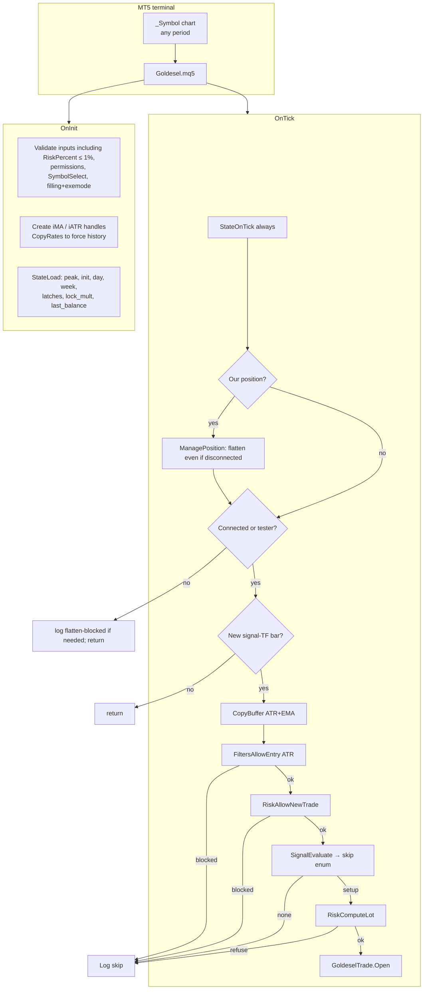
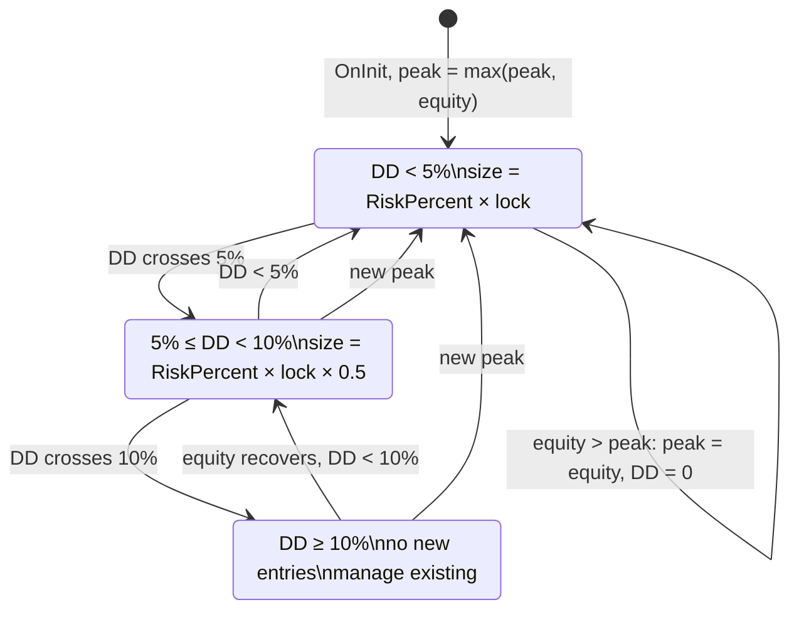

# Goldesel — Production MT5 Expert Advisor

| Field | Value |
|---|---|
| **Document** | Goldesel Design Specification |
| **Author** | Engineering (implementation agents follow this spec) |
| **Date** | 2026-09-08 |
| **Status** | Draft |
| **Version** | 1.2 |
| **Code name** | Goldesel (German: “golden donkey” — survival-first sizing, not alchemy) |
| **License** | MIT |
| **Primary symbol** | Chart symbol; conservative defaults tuned for XAUUSD |
| **Secondary symbol** | Same code path; preset for EURUSD |
| **Platform** | MetaTrader 5 (MQL5), hedge or netting |

---

## DISCLAIMER — READ BEFORE ANYTHING ELSE

**This software cannot be guaranteed profitable. Past backtests, forward tests, or live results do not predict future results.**

Goldesel is a piece of local trading **software**, not a financial product, not an investment advisor, not a managed account, and not a regulated offering. It places market orders according to mechanical rules. Those rules can and will lose money.

**You can lose the entire deposit**, including on a $10 account, a $20 account, and a large account. High leverage (1:500 or higher) does not create edge; it only increases how fast a wrong position consumes margin. Stops can gap. Spreads can explode. Brokers can requote, reject, or widen stops-level. Gold (XAUUSD) is especially hostile to small accounts because a 0.01 lot stop of a few dollars can be a double-digit percentage of a $10–20 balance.

- Do not deposit money you cannot afford to lose.
- Do not interpret “designed for small accounts” as “safe for small accounts.”
- Do not interpret a green Strategy Tester report as a forecast.
- The author and contributors provide **no warranty of merchantability or fitness for a particular purpose** (see `LICENSE`).

**Forbidden by this design (will not be implemented, not even as optional inputs):** martingale, grid-without-hard-caps, recovery averaging / “add to losers,” martingale-like lot multipliers after a loss, and any always-in-the-market / no-stop pattern. Those are the usual ways small high-leverage accounts die.

The product goal is **survival-first position sizing with a simple, testable edge** — not marketing claims, and not a compounding promise.

---

## Overview

Retail “small account to passive income” EAs usually fail for physical reasons, not for lack of indicators: $10–20 equity cannot absorb a gold stop at broker-minimum lot; martingale/grid hides that fact until one streak wipes the account; kitchen-sink filters overfit tester spread. Goldesel is a **single-file-plus-includes** MetaTrader 5 Expert Advisor that trades **one position per chart symbol**, sizes that position from **percent of equity against a real stop in account currency**, and **refuses the trade** when the broker minimum lot would exceed a hard risk cap.

The edge is one well-known pattern: **higher-timeframe EMA trend + signal-timeframe pullback continuation**, with **ATR-based stop**, **R-multiple take profit**, **break-even then chandelier trail**, **London+New York session window**, and **ATR-relative spread filter**. Risk **only decreases** after losses or after equity milestones; never increases because leverage “allows it.”

Default instrument is **XAUUSD** (gold trends; session structure is real). **EURUSD** uses the same code path and the same ATR-multiple parameters via a second `.set` file. The EA attaches to whatever chart it is dropped on (`_Symbol`), including broker suffixes (`XAUUSDm`, `GOLD`, `XAUUSD.a`).

This document is the implementation spec. An MQL5 engineer should not need to invent policy.

---

## Background & Motivation

### Current state

The workspace `/Users/df/Desktop/MT5-Goldesel` is empty. This is a greenfield build. There is no legacy EA to wrap, no existing magic-number convention, and no shared include library beyond the MQL5 Standard Library (`Trade/Trade.mqh`).

### Pain points this design exists to prevent

1. **Small-account physics ignored.** “Just trade 0.01 because leverage is 1:500” is how a $20 gold account takes a 20–100% hit on a normal H1 ATR stop.
2. **Blow-up patterns sold as “recovery.”** Martingale, grid, and averaging losers have positive expectancy *until* they don’t; the left tail is the product.
3. **Signal-on-every-tick.** Retail EAs spam orders, repaint intra-bar, and crawl in the tester.
4. **Kitchen-sink optimization.** Forty inputs + genetic optimizer = a curve-fit that dies live.
5. **Production MT5 details skipped.** Filling mode, stops-level, freeze-level, netting vs hedging, server time vs GMT, and tester-vs-live branching are where “it compiled” EAs fail.

### Why a simple trend-pullback EA, not a platform

The user asked for something super smart but not over-engineered, simple to configure, fast, and aimed at long-run survival with a testable edge. That is a **tight risk engine + one setup**, not a multi-symbol dashboard with news APIs.

---

## Goals & Non-Goals

### Goals (v1)

- Compile with zero errors / zero warnings-as-policy on a current MT5 build.
- Trade **XAUUSD or EURUSD** (or any FX/metal the user attaches) with **symbol-agnostic** ATR/EMA parameters.
- Size every order from **equity × effective risk %** vs **stop distance in account currency**, after a commission reserve, with a hard **1% of equity** cap that **includes** spread/slippage effective distance.
- **Refuse** (log + skip reason) rather than over-risk when min lot is too large.
- **One Goldesel instance per account** as the default operational rule; **one** magic-isolated position per chart. No pyramid, no hedge basket.
- Reduce risk on drawdown and after equity milestones; **never** increase size after a loss (profit-lock is a ratchet; daily/weekly halt is latched).
- Daily / weekly loss circuit breakers that stay on until the next period.
- Cheap `OnTick` (new-bar signal path; intra-bar only for BE/trail/flatten). Friday flatten is attempted even if the terminal is disconnected (cannot send, but must log loudly).
- Two conservative `.set` files, ≤ 18 user-visible inputs, chart `Comment()` status.
- README a human can follow: install, attach, tester (GMT vs server time), min-balance formula, $20-will-not-trade examples, disclaimer.
- Public GitHub, MIT, no binaries.

### Non-goals (v1 and explicit forever-unless-a-new-RFC)

- No GUI panel, no custom dashboard app, no DLL, no WebRequest, no Telegram, no email signals.
- No multi-symbol from one chart (one EA instance per chart/symbol).
- No ML, no “AI news,” no economic-calendar integration (news blackout is a documented non-goal; users who care pause manually).
- No martingale, grid, recovery averaging, martingale-after-loss, or always-in-the-market mode — **not even behind an input**.
- No claim of regulatory compliance or investment-advisor status.
- No license lock, no obfuscation, no account-binding.
- No VPS auto-provision, no installer, no auto-optimization inside the EA.
- No Sharpe / win-rate / profit-factor **promise**. Design intent only; users validate on their broker’s data.
- No partial closes, no scaling-in, no pending-order entry (v1 is market-on-new-bar). Partial **opens** (IOC) are accepted at the smaller fill; remainder is not chased.
- **No RSI** in v1 — not as an input and not as a compile flag. Revisit only in a new RFC with a specified handle.

---

## Key Decisions

These are closed. Implementation must not re-litigate them without a spec change.

| # | Decision | Choice | Rationale |
|---|---|---|---|
| K1 | Primary symbol | **XAUUSD** as default preset; chart `_Symbol` at runtime | Gold trends and has real session structure. Code is symbol-agnostic. |
| K2 | Strategy | **H1 EMA 21/55 bias + M15 pullback continuation + ATR SL + 2R TP + BE/trail** | Least-wrong simple edge for this user profile. See Alternatives. |
| K3 | Risk base | **0.5% of equity per trade** (`InpRiskPercent`) | Survival-first. Small accounts will feel slow; that is the point. |
| K4 | Hard risk cap | **`kMaxRiskPercent = 1.0` of equity, after lot rounding, including spread+slippage extra distance and the commission reserve.** `OnInit` **fails** if `InpRiskPercent > 1.0`. | Paper 1% that live fills may pierce is not a 1% cap. 1.25× planned is an extra tightness skip only. |
| K5 | Leverage | **Margin headroom only.** Never a sizing input | High leverage does not increase `lot`. `OrderCalcMargin` is a hard gate. |
| K6 | Min-lot policy | **Refuse** if computed lot < min lot **and** min lot would exceed `kMaxRiskPercent` | No secret “tiny account mode” that over-risks. |
| K7 | Drawdown circuit | **DD ≥ 5% → risk × 0.5; DD ≥ 10% → halt new entries until DD < 10%** | Desk-style anti-tilt. Halt does **not** require a new peak. Existing position still managed. Peak/initial follow K32 cash-flow order. |
| K8 | Profit lock | **ON.** Persist initial balance. +50% → 0.35%; +100% → 0.25%. **`lock_mult` ratchets down only.** | De-risk as the account grows. A giveback must not re-arm 0.5%. |
| K9 | Daily / weekly halt | **2% day / 5% week**, closed **+ floating**, **latched until the next period boundary** (persisted) | Prevents bounce-then-revenge. A −2.1% day that bounces to −1.9% stays halted. |
| K10 | Recovery | **Never** increase size after a loss | Forbidden pattern. Enforced by K8 ratchet + no lot multiplier. |
| K11 | Positions | **One instance per account (README default). One position per symbol per magic.** No pyramid. | Two charts can otherwise double the 1% promise. Code warns; README is the operational cap. |
| K12 | Entry timing | **New bar on signal TF only** (`iTime` change). Market order | Tester-friendly, no intra-bar repaint entries. |
| K13 | RSI filter | **Out of v1 entirely.** No handle, no `#define GOLDESEL_USE_RSI` | A compile flag without a handle is a fork. Curve-fit knob stays out. |
| K14 | News filter | **Out of v1** | Calendar feeds need WebRequest/DLL or manual timestamps; both are non-goals. |
| K15 | Sessions | **07:00–20:00 live = broker server time; tester = GMT.** Overnight wrap supported. Eligibility = **bar-1 open time**. | MetaQuotes: tester `TimeTradeServer() == TimeGMT()`. Same `.set` is a different clock live vs tester. |
| K16 | Friday flatten | **ON.** Close time from `SymbolInfoSessionTrade` last Friday session end, minus 30 minutes. Fallback 21:00 server only if the session API returns nothing. Attempt flatten even when disconnected (log `FLATTEN_BLOCKED_DISCONNECTED`). Persistent `FLATTEN_FAIL` until flat. | Weekend gap is first-class. A VPS blip at 20:20 must not silently skip flatten. Hardcoded 21:00 is wrong for many gold feeds. |
| K17 | Spread filter | **Skip if spread > 0.15 × ATR(price)**, not a raw-points default | Gold vs EURUSD differ by an order of magnitude; ATR-relative is symbol-agnostic. |
| K18 | SL geometry | **One algorithm:** 1.5 × ATR beyond the farther of signal-bar extreme and fast EMA; then push to `min_dist` from **Bid (long) / Ask (short)**. Floor includes 2× spread, stops-level+1 tick, freeze-level+1 tick. | Brokers validate stops vs the exit side, not vs entry. Two sketches in v1.0 were a fork. |
| K19 | TP / BE / trail | **TP 2.0R; BE at +1.0R (SL → entry ± spread); chandelier at +1.5R from closed-bar extreme − 1.0 ATR.** Bid/Ask are a **clamp** only (never trail through market). **`InpUseTrail` bundles BE and trail** (one input). Recover R from GV or order comment, **never** from a post-BE SL. | Input budget is 18. BE-only would need a 19th input. |
| K20 | Filling | **`SYMBOL_FILLING_MODE` bits are only FOK (1) and IOC (2).** There is **no** `SYMBOL_FILLING_RETURN` identifier — do not use it and do not `#define` a fake flag. Allow `ORDER_FILLING_RETURN` only when `SYMBOL_TRADE_EXEMODE` is **not** `SYMBOL_TRADE_EXECUTION_MARKET` (Instant/Request/Exchange; typically `flags==0`). Never RETURN on Market Execution. Prefer FOK then IOC. Per-order `INVALID_FILL` fallback FOK↔IOC. IOC partial: **accept the smaller lot.** | `SYMBOL_FILLING_RETURN` does not compile. RETURN on gold Market Execution is a live `INVALID_FILL`. |
| K21 | Trade API | **`CTrade` wrapped once** (`GoldeselTrade`). Deviation is a **price** (`max(ticks × tick_size, 1 × spread)`), converted to points for `SetDeviationInPoints`. | 30 “points” is $0.30 on 2-digit gold and $0.03 on 3-digit gold. |
| K22 | Persistence | **Live: `GlobalVariableSet` keyed by magic+login. Tester/optimization: RAM primary; always re-seed in `OnInit`.** | Agent-local GVs leak across optimization passes. Tester GVs are already isolated from terminal F3. |
| K23 | Inputs | **Exactly 18 user-visible inputs**, grouped. Advanced values are `#define` | Do not overwhelm. |
| K24 | Chart TF | **Any.** Handles request M15/H1 (or whatever inputs) internally | User may attach on M1 or H1; signals do not depend on the chart period. |
| K25 | Magic | **Default `20260908`** | Unique enough; user-overridable. |
| K26 | License / repo | **MIT, public GitHub, no `.ex5` in git** | Production-ready distribution as source. |
| K27 | Tester claims | **None.** Shipping bar is correctness + risk invariants | Honesty about expectancy. |
| K28 | OrderCalcProfit | **Legal volume then scale** (`max(VOLUME_MIN, min(1.0, VOLUME_MAX))`). Tick fallback uses `TICK_VALUE_LOSS` (long) / `TICK_VALUE_PROFIT` (short). Profit `0` always falls back. | Volume 1.0 is illegal on some micro/CFDs. `TICK_VALUE` is the ask/profit side. |
| K29 | Overnight | **Mon–Thu positions may run overnight; Friday flatten** | Trend-pullback needs room; weekend gap is the one we refuse. |
| K30 | Feature flags | **`InpUseTrail` (BE+trail together), `InpUseSessions`, `InpFridayFlatten`.** Profit-lock disable is `#define GOLDESEL_USE_PROFIT_LOCK 1`. | Rollback without a rebuild. |
| K31 | Halt ownership | **`RiskAllowNewTrade` owns DD / daily / weekly / flatten-fail-as-entry-block. `FiltersAllowEntry` owns session / spread / Friday-window / CLOSEONLY / algo / in-position.** | Dual ownership was a revenge-trade hole. |
| K32 | Cash flow | **`cash_delta = (ΔACCOUNT_BALANCE) − (our-magic DEAL_PROFIT+COMMISSION+SWAP this tick)`.** Do **not** treat a 1% balance change as a deposit — a 2R winner at 0.5% risk is ~1% of equity. `StateOnTick` order: (1) `initial/day/week_equity += cash_delta`; (2) withdrawal: `peak = max(0, peak + cash_delta)`; deposit: **do not** add to peak; (3) `peak = max(peak, equity)`. | A 1% jump aliases the strategy’s own TP, kills profit-lock, and can double-count deposits into a fake DD halt. |
| K33 | Close path | **Always `PositionClose(ticket)` after magic+symbol filter. Never `PositionClose(_Symbol)`.** | Netting symbol-close ignores magic and can flatten a manual/other-EA position. |
| K34 | Tester flags | **Ban bare `MQL_TESTER` / `MQL_OPTIMIZATION` as booleans.** Always `MQLInfoInteger(...)`. Helpers: `GeIsTester()`, `GeIsOptimizing()`. | `MQL_TESTER` as a ternary is always true (non-zero enum). |
| K35 | Commission | **`kCommissionHaircut = 0.10` of the risk budget reserved so SL-distance + estimated round-turn stays ≤ 1%.** README: stated % is not broker round-turn. | `OrderCalcProfit` ignores commission. At MVB a gold commission can pierce 1%. |
| K36 | Time API | **`TimeToStruct` only.** No `TimeDayOfWeek` (MQL4). Week key = **Monday date** `YYYYMMDD`. | Dual week algorithms and MQL4 identifiers fail compile or fork week 1. |
| K37 | CLOSEONLY | **Blocks new entries (`SKIP_CLOSEONLY`). Flatten, BE, trail still run.** | Fail-init only on `DISABLED`. |
| K38 | Skip tokens | **One token: `GeSkipName(enum)` in Journal, CSV, and chart `last=`. Position comment is `GE|{version}|{R}`.** | `last=MINLOT_RISK` vs `SKIP_MINLOT_RISK` was a log fork. |
| K39 | Product language | **Survival-first position sizing.** README leads with the disclaimer and the $20-will-not-trade examples. No compounding pitch. | Public GitHub will be quoted out of context. |
| K40 | First-entries gate | **Friday flatten ships in the same PR as the first `TradeOpen`.** Do not attach live until that PR. | An EA that can enter but cannot flatten is a weekend-gap product. |

---

## Proposed Design

### Repository layout

```
/Users/df/Desktop/MT5-Goldesel/
  README.md
  LICENSE                          # MIT
  CONTRIBUTING.md
  .gitignore
  docs/
    DESIGN.md                      # copy of this spec (implementation PR 7)
  Sets/
    Goldesel-XAUUSD-Conservative.set
    Goldesel-EURUSD-Conservative.set
  MQL5/
    Experts/
      Goldesel/
        Goldesel.mq5               # EA: inputs, OnInit/OnDeinit/OnTick/OnTradeTransaction
    Include/
      Goldesel/
        Config.mqh                 # #defines, skip-reason enum, input-struct copy
        Risk.mqh                   # lot, DD, daily/weekly, profit lock, min-lot refusal
        Trade.mqh                  # CTrade wrapper: filling, stops-level, retries
        Signal.mqh                 # EMA bias, pullback, ATR SL/TP
        Filters.mqh                # session, spread, Friday window
        State.mqh                  # GV persistence, peak/init/day/week, cash-flow residual
        Log.mqh                    # Print, Comment, CSV event log
        Util.mqh                   # time, digits, tester flags, human error strings
```

Keep the include count small. If a file would be < 40 lines, fold it into a neighbor (`Config.mqh` may live at the top of `Goldesel.mq5` if that stays readable). **Do not** add a framework, a CPositionInfo soup of unused Standard Library classes, or a “strategy pattern” hierarchy. Four verbs matter: **may we trade, what is the signal, what is the lot, send/modify/close.**

Suggested mapping if we must drop files to stay readable: `Config.mqh` + `Util.mqh` can merge; `Log.mqh` can merge into `State.mqh`. The split above is the target. `Goldesel.mq5` should stay under ~400 lines of orchestration.

### Module responsibilities

| File | Owns | Must not own |
|---|---|---|
| `Goldesel.mq5` | Inputs, lifecycle, `OnTick` cheap path, wiring | Lot math, indicator math, raw `OrderSend` |
| `Config.mqh` | `#define` constants, `ENUM_GE_SKIP`, copied runtime config | Trading |
| `Risk.mqh` | Effective risk %, lot, halt flags, margin gate, commission haircut | Signals, session hours |
| `Trade.mqh` | Fill mode, deviation-in-price, retries, stops-level vs Bid/Ask, ticket close | Strategy |
| `Signal.mqh` | Bias, pullback, structural SL/TP, skip enum | Sizing |
| `Filters.mqh` | Session, spread, Friday window, CLOSEONLY, algo, in-position | Halt latches |
| `State.mqh` | GV names, load/save, day/week rollover, cash-flow residual, lock ratchet persist | Orders |
| `Log.mqh` | `Print`, `Comment`, CSV | Decision logic |
| `Util.mqh` | `GeIsTester()`, `GeIsOptimizing()`, `GeTimeToStruct()`, error text, digits | — |

### Runtime architecture



### OnTick control flow (normative)

```mermaid
flowchart TD
  A[OnTick] --> C[StateOnTick: cash-flow residual,<br/>then peak = max(peak, equity)]
  C --> D[CommentUpdate<br/>no-op if GeIsOptimizing]
  D --> E{CountOurPositions > 0}
  E -->|yes| F[ManagePosition first:<br/>Friday flatten even if disconnected]
  F --> G
  E -->|no| G{GeReady?}
  G -->|no| B1[Try CopyRates once / 1s<br/>return]
  G -->|yes| H{Connected OR GeIsTester?}
  H -->|no| Z1[if flatten window: last=FLATTEN_BLOCKED_DISCONNECTED<br/>return — no new entries]
  H -->|yes| I{NewSignalBar?}
  I -->|no| Z[return]
  I -->|yes| J[CopyBuffer ATR+EMA 3 bars]
  J --> K{FiltersAllowEntry atr}
  K -->|no| L[LogEvent SKIP]
  L --> Z
  K -->|yes| M{RiskAllowNewTrade}
  M -->|no| L
  M -->|yes| N[SignalEvaluate bar 1 → why]
  N -->|none| L
  N -->|long/short| O[RiskComputeLot]
  O -->|min-lot / max-risk / margin / slip-cap| L
  O -->|ok| P[TradeOpen with SL TP]
  P --> Q[LogEvent OPEN]
  Q --> Z
```

**Cheap path invariant:** if it is not a new signal-TF bar **and** there is no open Goldesel position **and** we are not in the Friday flatten window, `OnTick` does: `StateOnTick`, comment throttle, return. No `CopyBuffer`, no `FileOpen`, no `OrderCalc*`.

**Disconnected invariant:** never skip `ManagePosition` / flatten because `TERMINAL_CONNECTED` is false. New entries still require connection (or tester).

Comment throttle: update at most once per second (`TimeCurrent()` change) or on events. Never if `GeIsOptimizing()`.

### Indicator handles (created in `OnInit`, never per tick)

```mq5
int g_hFastBias = iMA(_Symbol, InpBiasTF,   InpFastEMA, 0, MODE_EMA, PRICE_CLOSE);
int g_hSlowBias = iMA(_Symbol, InpBiasTF,   InpSlowEMA, 0, MODE_EMA, PRICE_CLOSE);
int g_hFastSig  = iMA(_Symbol, InpSignalTF, InpFastEMA, 0, MODE_EMA, PRICE_CLOSE);
int g_hATR      = iATR(_Symbol, InpSignalTF, InpATRPeriod);
```

Four handles. **No RSI handle.** `OnDeinit`: `IndicatorRelease` all four. Invalid handle (`INVALID_HANDLE`) → `INIT_FAILED`.

Copy **3 bars** (indices 0,1,2) via `CopyBuffer` on the new-bar path (before spread filter) and when managing a trail (ATR[1] for chandelier). Never call `iMA()`/`iATR()` as series functions inside loops.

History gate:

```
need_bias   = InpSlowEMA + 5
need_signal = max(InpFastEMA, InpATRPeriod, kPullbackBars) + 5
```

`OnInit` calls `CopyRates(_Symbol, InpBiasTF, 0, need_bias, tmp)` and the same for signal TF to **request** history, then returns `INIT_SUCCEEDED` even if fewer bars are present. `OnTick` sets `g_ready = false` until `BarsCalculated(handle) >= need` for all handles **and** `CopyBuffer` returns the requested count. Until ready: no **entries**. Flatten still runs if a position exists. One `Print` per 10s max: `"Goldesel: waiting for history"`.

---

## Strategy specification (normative, bar-1)

All signal math uses the **last closed bar** (index 1) on the respective timeframe. Index 0 is the forming bar and is **never** used for entry decisions. Evaluation runs once when `iTime(_Symbol, InpSignalTF, 0)` changes.

### Bias (higher TF, default H1)

Let `ema_fast_bias = buffer of g_hFastBias[1]`, `ema_slow_bias = g_hSlowBias[1]`, `close_bias` from `CopyRates` of 2 bars on the bias TF (do not use `iClose` in a loop).

```
bias_long  = (ema_fast_bias > ema_slow_bias) && (close_bias > ema_slow_bias)
bias_short = (ema_fast_bias < ema_slow_bias) && (close_bias < ema_slow_bias)
if neither: SKIP_NO_BIAS
```

Defaults: EMA 21 / EMA 55, `MODE_EMA`, `PRICE_CLOSE`, `InpBiasTF = PERIOD_H1`.

### Pullback continuation (signal TF, default M15)

Constants (`Config.mqh`):

```mq5
#define kPullbackBars     5      // lookback on signal TF, closed bars
#define kEntryATRFrac     0.25   // "came within" distance of fast EMA
#define kMaxChaseATR      1.00   // reject late chase: close too far beyond EMA
```

Let `ema = g_hFastSig[1]`, `atr = g_hATR[1]`. If `atr <= 0`, `SKIP_ATR`.

Copy `kPullbackBars+1` rates on signal TF (bars 1..kPullbackBars).

**Long setup** (requires `bias_long`):

1. **Touch:** among bars `i = 1..kPullbackBars`, at least one bar has  
   `Low[i] <= ema_at_1 + kEntryATRFrac * atr`  
   (using `ema[1]` for all i is acceptable v1 simplicity — do **not** copy EMA per lookback bar unless it stays ≤ 8 extra buffer reads).
2. **Reclaim (bar 1):** `Close[1] > ema` AND `Close[1] > Open[1]`.
3. **Not a chase:** `(Close[1] - ema) <= kMaxChaseATR * atr`. Else `SKIP_CHASE`.

If bias is long but touch/reclaim fail: `SKIP_NO_PULLBACK`.

**Short setup** (mirror):

1. **Touch:** `High[i] >= ema - kEntryATRFrac * atr` for some `i` in 1..kPullbackBars.
2. **Reclaim:** `Close[1] < ema` AND `Close[1] < Open[1]`.
3. **Not a chase:** `(ema - Close[1]) <= kMaxChaseATR * atr`.

If both long and short would fire (should not, given bias), **no trade** (`SKIP_AMBIGUOUS`).

```mq5
enum ENUM_GE_DIR { GE_DIR_NONE = 0, GE_DIR_LONG = 1, GE_DIR_SHORT = -1 };

struct GeSetup
{
   ENUM_GE_DIR dir;
   double      ema_fast_sig;
   double      atr;
   double      bar1_low;
   double      bar1_high;
   double      bar1_close;
   datetime    bar1_time;   // open time of bar 1 — session eligibility
};

bool SignalEvaluate(GeSetup &out, ENUM_GE_SKIP &why);
```

`SignalEvaluate` **must** set `why` on failure (`SKIP_ATR`, `SKIP_NO_BIAS`, `SKIP_NO_PULLBACK`, `SKIP_CHASE`, `SKIP_AMBIGUOUS`). On success: `why = SKIP_NONE`, `dir` is LONG or SHORT.

### Stop loss — one algorithm

Entry is a **market** order at current `Ask` (long) or `Bid` (short) on the new bar.

**Step A — structural SL** (`SignalSLTP`):

```
spread_price = Ask - Bid     // do not use SPREAD * POINT as the only source; use Ask-Bid

// LONG
sl_from_extreme = setup.bar1_low      - InpSLATRMult * setup.atr
sl_from_ema     = setup.ema_fast_sig  - InpSLATRMult * setup.atr
sl_raw          = MathMin(sl_from_extreme, sl_from_ema)   // farther below

// SHORT
sl_from_extreme = setup.bar1_high     + InpSLATRMult * setup.atr
sl_from_ema     = setup.ema_fast_sig  + InpSLATRMult * setup.atr
sl_raw          = MathMax(sl_from_extreme, sl_from_ema)   // farther above
```

**Step B — normalize vs exit side** (`GeNormalizeStops`). Delete any `MathMin(sl_raw, sl_floor)` “tighter of floor” sketch. The floor is a **minimum distance**, never a tighter stop.

```
tick   = SYMBOL_TRADE_TICK_SIZE
point  = SYMBOL_POINT
stops  = SYMBOL_TRADE_STOPS_LEVEL
freeze = SYMBOL_TRADE_FREEZE_LEVEL
ref    = long ? Bid : Ask          // EXIT side: buy SL/TP vs Bid, sell SL/TP vs Ask

min_dist = kSpreadFloorMult * spread_price          // 2.0 × spread
if(tick > 0)
{
   min_dist = MathMax(min_dist, (double)(stops  + 1) * tick);
   min_dist = MathMax(min_dist, (double)(freeze + 1) * tick);
}

if(long)
{
   if(ref - sl_raw < min_dist) sl = ref - min_dist;
   else                        sl = sl_raw;
}
else
{
   if(sl_raw - ref < min_dist) sl = ref + min_dist;
   else                        sl = sl_raw;
}

R  = MathAbs(entry - sl)           // money-risk distance uses fill side vs SL
TP = long ? entry + InpTPRMultiple * R
          : entry - InpTPRMultiple * R

// TP also vs exit side:
if(long  && tp - Bid < min_dist)  → SKIP_TP_LEVEL
if(short && Ask - tp < min_dist)  → SKIP_TP_LEVEL
```

`InpSLATRMult` default `1.5`. `kSpreadFloorMult = 2.0`. Normalize SL/TP with `SYMBOL_DIGITS`. **Never assume 5-digit FX or 2-digit gold.**

If structural SL would be on the wrong side of `ref` after bump, `SKIP_STOPS_LEVEL`.

### Take profit

Default `InpTPRMultiple = 2.0`. v1 always sends SL **and** TP on the entry order. No SL-only.

### Break-even and trail (intra-bar, only if a position exists)

```mq5
#define kBE_R                 1.0
#define kTrailStartR          1.5
#define kTrailATRMult         1.0
```

**K19:** `InpUseTrail == false` disables **both** BE and trail (fixed SL/TP only). There is no BE-only mode in v1.

Favorable price: long uses `Bid`, short uses `Ask`.

**R recovery (normative, no last-resort-from-current-SL):**

1. Prefer `g_state.init_r` / `init_sl` from GV (live) or RAM (tester).
2. Else parse the position comment `GE|{version}|{R}` (`StringSplit` on `|`, third field).
3. If still missing **and** current SL is on the **loss** side of entry (long: SL < entry; short: SL > entry): may reconstruct `R = |entry - current SL|` **only if** SL has never been moved to BE (i.e. still beyond entry). 
4. If current SL is on the **profit** side of entry, **do not** recompute R from it (that shrinks R and trails too early). Skip BE/trail this tick; log `ERROR` once: `"init_r missing after BE"`. Flatten still runs.

Store `init_sl` and `init_r` at **successful OPEN** (requested SL distance). On `OnTradeTransaction` FILL, if the fill price moved, recompute `init_r = |fill - sl|` and persist.

**+1.0R break-even** (only if `InpUseTrail`):

```
if long  and Bid >= P + kBE_R * R:  new_sl = P + spread_price
if short and Ask <= P - kBE_R * R:  new_sl = P - spread_price
```

Only modify if `new_sl` is **tighter** than `sl_now` and `|ref - new_sl| >= min_dist`. If freeze blocks the modify, skip this tick (`SKIP_FREEZE` is a modify skip, not an entry skip); retry next tick.

**+1.5R chandelier (v1 exact):**

- Window: closed signal-TF bars with `time >= POSITION_TIME`, cap 500 bars. **Closed bars only.** Do **not** use current Bid/Ask as a chandelier “close.”
- `atr = g_hATR[1]`.
- Long: `highest_close` of those bars (if none, use `P`). `trail_sl = highest_close - kTrailATRMult * atr`.
- Short: `lowest_close`; `trail_sl = lowest_close + kTrailATRMult * atr`.
- Apply only when MFE ≥ `kTrailStartR * R`.
- **Clamp:** if trail SL would be on the wrong side of Bid (long) / Ask (short), or within `min_dist` of it, **do not send** that trail this tick (never trail through the market; never freeze-kill the position).
- Combined candidate = tightest of `{current SL, BE if due, trail if due}`. **Never loosen.**

```mq5
void ManagePosition();   // flatten first, then BE/trail
```

### One-and-done per bar

At most **one** entry attempt per new signal bar. If send fails, log and wait for the **next** bar (do not retry entries intra-bar except the Trade wrapper’s 2 immediate retries on the same call).

---

## Filters

```mq5
bool FiltersAllowEntry(const double atr, ENUM_GE_SKIP &why);
```

Evaluated on new signal bars only, **after** ATR has been copied, **before** signal. Halt flags are **not** here (K31).

| Order | Filter | Rule | Skip code |
|---|---|---|---|
| 1 | Trade mode | `SYMBOL_TRADE_MODE_CLOSEONLY` → block entries | `SKIP_CLOSEONLY` |
| 2 | Algo trade | `MQLInfoInteger(MQL_TRADE_ALLOWED)` and `TerminalInfoInteger(TERMINAL_TRADE_ALLOWED)` and `AccountInfoInteger(ACCOUNT_TRADE_EXPERT)` and `ACCOUNT_TRADE_ALLOWED` | `SKIP_NO_ALGO` |
| 3 | Already in | `CountOurPositions() > 0` | `SKIP_IN_POSITION` |
| 4 | Friday flatten window | `FiltersInFridayFlattenWindow` (also blocks new entries) | `SKIP_FRIDAY_FLAT` |
| 5 | Flatten fail sticky | `g_flatten_fail && CountOurPositions() > 0` | `SKIP_FLATTEN_FAIL` |
| 6 | Session | if `InpUseSessions`: **bar-1 open time** in session (wrap-aware) | `SKIP_SESSION` |
| 7 | Spread | `atr <= 0` → `SKIP_ATR`; else skip if `spread_price > InpMaxSpreadATRFrac * atr` | `SKIP_SPREAD` |

Disconnected is **not** a `FiltersAllowEntry` row. The `OnTick` skeleton blocks new entries when disconnected **after** flatten has been attempted.

`InpMaxSpreadATRFrac` default `0.15`. Example: ATR = $8.00 on gold → max spread $1.20.

**News:** v1 non-goal. README tells users to flatten or disable algo around high-impact events if they wish.

### Session mapping (documentation required in README)

**Live:** inputs are **broker server time** via `TimeTradeServer()` + `TimeToStruct`. Not GMT, not `TimeLocal()`.

**Tester / optimization:** MetaQuotes documents `TimeLocal() == TimeTradeServer() == TimeGMT()`. A 07:00–20:00 window in Strategy Tester is **07:00–20:00 GMT**, not the user’s GMT+2/+3 server. The same `.set` trades a **different cash window** live vs tester. README and Testing must say this in those words. Users who want tester ≈ live should shift `InpSessionStartHour` / `EndHour` for the tester run, or accept the GMT clock.

Typical live mappings for “gold active ~07–20 GMT”:

| Broker server | Offset vs GMT (winter / summer) | `InpSessionStartHour` for ~07:00 GMT | Notes |
|---|---|---|---|
| Many EU brokers | GMT+2 / GMT+3 | 9 / 10 | London 08:00 GMT ≈ 10:00 server in summer |
| GMT+0 server | 0 | 7 | Matches defaults if the server is GMT |
| Default ship | unknown | **7–20** | User **must** verify comment `server=` vs a world clock |

**Overnight wrap (normative):** `InpSessionStartHour != InpSessionEndHour` is required; `start > end` is **legal** (e.g. 22 → 6).

```
FiltersHourInSession(hour):
  if start < end:  return hour >= start AND hour < end
  else:            return hour >= start OR  hour < end    // wrap
```

**Bar eligibility (normative):** a setup is in-session if `TimeToStruct(bar1_open).hour` passes `FiltersHourInSession`. Do **not** use the current forming bar’s hour. Consequence: the M15 bar that **opens** at 19:45 and **closes** at 20:00 is eligible when evaluated at 20:00 on a `[7,20)` window, because bar-1 open hour is 19. The bar that opens at 20:00 is not.

Hours have no minutes. Friday flatten **does** use minutes (session-API close minus 30). That difference is accepted.

Default `InpUseSessions = true`.

### Friday flatten

```mq5
#define kFridayCloseHourFallback           21
#define kFridayCloseMinuteFallback         0
#define kMinutesBeforeFridayClose          30
```

`InpFridayFlatten` default `true`.

**Close timestamp (normative):**

1. `TimeToStruct(TimeTradeServer(), dt)` — **no `TimeDayOfWeek`**.
2. If `dt.day_of_week != 5` (Sunday=0 … Friday=5): not Friday; flatten window = false. (If a position is still open on Saturday/Sunday because Friday close failed, **keep trying to flatten** whenever `FiltersMarketHasTradeSessionNow` or the server is in a trade session — see stuck-open below.)
3. Enumerate `SymbolInfoSessionTrade(_Symbol, FRIDAY, i, ses_from, ses_to)` for `i = 0..9` until it returns false. Take the **latest `ses_to`** (time-of-day; date part is typically 1970). Combine with **this week’s Friday calendar date** to get `friday_close`.
4. If no session returned: `friday_close` = today at `kFridayCloseHourFallback:kFridayCloseMinuteFallback` server.
5. Flatten window: `now >= friday_close - kMinutesBeforeFridayClose * 60` AND (now is still Friday **or** we still have a position after Friday close).

`OnInit` prints the derived Friday close and the fallback-or-API source.

**Disconnected (normative):** if the flatten window is active and `!TERMINAL_CONNECTED && !GeIsTester()`:

- Do **not** pretend flatten ran.
- `Print` + CSV + `g_last_skip = SKIP_FLATTEN_BLOCKED_DISCONNECTED` at least once per 10s (this is the one allowed “spam” — weekend gap is critical).
- Block new entries.
- On reconnect, `ManagePosition` retries close immediately.

**Close failures:** `CloseAllOurPositions` always by **ticket** (K33). Freeze-level can reject close; that is **not** modify-only. Wrapper: 2 retries per call, then every tick in the window. While a our-position remains in the window: `g_flatten_fail = true`, `g_last_skip = SKIP_FLATTEN_FAIL`, block new entries. Clear `g_flatten_fail` only when `CountOurPositions()==0`.

**Stuck over the weekend:** if we still hold a position on Saturday/Sunday (close never filled), keep calling `CloseAllOurPositions` on every tick when connected, until flat. Do not wait for next Friday.

Mon–Thu: no auto-close at session end (overnight hold allowed). Only Friday flatten is the weekend-gap control.

---

## Risk engine

### Halt / manage transition table (normative)

| Condition | New entries | Manage BE/trail | Friday flatten |
|---|---|---|---|
| DD ≥ 10% | block (`SKIP_DD_HALT`) | yes | yes |
| Daily halt **latched** | block (`SKIP_DAILY_HALT`) | yes | yes |
| Weekly halt **latched** | block (`SKIP_WEEKLY_HALT`) | yes | yes |
| Min-lot / max-risk refuse | skip this bar | n/a | n/a |
| Friday flatten window | block (`SKIP_FRIDAY_FLAT`) | flatten **first**, no trail that tick | yes |
| Flatten fail sticky | block (`SKIP_FLATTEN_FAIL`) | keep trying close | yes |
| Session off | block (`SKIP_SESSION`) | yes | yes |
| CLOSEONLY | block (`SKIP_CLOSEONLY`) | yes | yes |
| Disconnected | block | flatten attempt + log | yes (send will fail; log `SKIP_FLATTEN_BLOCKED_DISCONNECTED`) |
| `InpUseTrail == false` | — | no BE/trail | yes |

`RiskAllowNewTrade` is the sole owner of: DD halt, daily latch, weekly latch, flatten-fail-as-entry-block (the last may also be checked in filters; if both check, they must use the same `g_flatten_fail` flag — **owner is Risk** if we need a single owner; Filters may read the flag). **Filters do not recompute daily PnL.**

### Effective risk percent

```mq5
double RiskEffectivePercent(const GeEquityState &st);
```

Pipeline (multiplicative, then cap):

```
base        = InpRiskPercent                          // default 0.50
lock_mult   = st.lock_mult                            // ratcheted, persisted
dd_mult     = 1.0
if DrawdownPct(st) >= kReduceDrawdownPct: dd_mult = kDrawdownRiskScale   // 5% → 0.5
if DrawdownPct(st) >= kHaltDrawdownPct:   halt new entries               // 10%

effective  = base * lock_mult * dd_mult
if effective > kMaxRiskPercent: effective = kMaxRiskPercent
if effective <= 0: halt
```

**Profit-lock ratchet (K8):**

```
growth = (equity / initial_balance) - 1.0
computed = 1.0
if growth >= 1.00: computed = 0.50     // 0.50% × 0.50 = 0.25%
else if growth >= 0.50: computed = 0.70 // 0.50% × 0.70 = 0.35%

lock_mult = min(st.lock_mult, computed)   // NEVER increases except GV reset
persist lock_mult
```

Initial `lock_mult = 1.0`. `#define GOLDESEL_USE_PROFIT_LOCK 1`. If the user raises `InpRiskPercent` to 1.0, lock still scales the same ratios, then `kMaxRiskPercent` applies.

A documented GV reset (delete `GE_{magic}_{login}_*`) is the **only** way to raise `lock_mult`. K32 cash-flow changes `initial_balance` so deposits do not trip the lock and withdrawals do not look like losses; they do **not** raise `lock_mult`. A 2R trade win is **not** cash flow and **does** increase growth %.

**Never** increase `effective` because a trade lost. **Never** read leverage or free margin into this percent.

### Drawdown state machine



Exact (after the K32 cash-flow steps in `StateOnTick`, never before):

```
PeakEquity  = max(PeakEquity, Equity)     // step 3 of StateOnTick; persist on change
DrawdownPct = (PeakEquity <= 0) ? 0
            : 100.0 * (PeakEquity - Equity) / PeakEquity
```

Equity = `AccountInfoDouble(ACCOUNT_EQUITY)` (includes floating).

Halt lifts when `DrawdownPct < kHaltDrawdownPct` (10%), **not** requiring a new peak. New peak always returns to Normal.

Peak is reduced on **withdrawals only** (K32 step 2) so banking profits does not freeze the EA in Halted. Deposits must **not** be added to peak before `max(peak, equity)` — that double-counts cash already inside equity.

Constants:

```mq5
#define kMaxRiskPercent         1.0
#define kReduceDrawdownPct      5.0
#define kHaltDrawdownPct       10.0
#define kDrawdownRiskScale      0.5
#define kSlippageRiskMult       1.25    // extra tightness vs planned; NOT a license to pierce 1%
#define kMarginFreeBuffer       0.80
#define kCommissionHaircut      0.10    // 10% of risk budget reserved for round-turn
#define kCashFlowEps            0.01    // account-currency rounding; NOT a % of balance
#define kDeviationSpreadMult    1.0
```

### Deposits and withdrawals (K32)

**Forbidden:** treating `|ΔACCOUNT_BALANCE| ≥ 1%` (or any fraction of balance) as cash flow. Default `InpRiskPercent = 0.5` × `InpTPRMultiple = 2.0` makes a full TP ≈ **1% of equity**. That alias would raise `initial_balance` on every winner, so the K8 ratchet never engages from trading, and would hide wins from daily PnL while 1R losers still count.

**Detection:** residual after subtracting **our-magic trade PnL** from the balance change. Not a percent threshold.

Accumulate in `OnTradeTransaction` (and/or a `HistorySelect` scan of new deals if a deal can land without a transaction — same sum, **do not double-count**):

```
// On TRADE_TRANSACTION_DEAL_ADD, HistoryDealGetTicket / HistoryDealGet*
if (DEAL_TYPE == DEAL_TYPE_BUY || DEAL_TYPE == DEAL_TYPE_SELL)
   && DEAL_MAGIC == InpMagic:
   g_deal_pnl_accum += DEAL_PROFIT + DEAL_COMMISSION + DEAL_SWAP
// Do NOT add DEAL_TYPE_BALANCE / CREDIT / CHARGE / BONUS / CORRECTION
// those ARE cash flow (the residual we want).
```

Other-magic / manual BUY-SELL PnL is **not** subtracted (v1 is one-instance-per-account; that residual is treated as cash flow). Swap on our close is included in the deal sum so overnight swap is not a “withdrawal.”

**`StateOnTick` order (normative, do not reorder):**

```
balance     = ACCOUNT_BALANCE
equity      = ACCOUNT_EQUITY
d_bal       = balance - last_balance
realized    = g_deal_pnl_accum          // consume
g_deal_pnl_accum = 0
cash_delta  = d_bal - realized
if |cash_delta| <= kCashFlowEps:        // 0.01 account currency, rounding only
   cash_delta = 0

// 1. Apply cash-flow to baselines (both signs)
if cash_delta != 0:
   initial_balance = MathMax(1e-6, initial_balance + cash_delta)
   day_equity      = day_equity  + cash_delta
   week_equity     = week_equity + cash_delta
   LogEvent("BALANCE_JUMP", ..., extra=cash_delta)

// 2. Peak vs cash-flow (asymmetric)
if cash_delta < 0:                      // withdrawal
   peak = MathMax(0.0, peak + cash_delta)
// deposit: do NOT add cash_delta to peak (equity already contains it)

// 3. High-water from equity LAST
peak = MathMax(peak, equity)

last_balance = balance
persist peak, init, dayeq, weekeq, bal
```

- **2R close:** `d_bal ≈ realized` → `cash_delta ≈ 0` → init/day/week/peak-step-2 unchanged → `peak = max(peak, equity)` can rise → growth `(equity/init)-1` **increases** → profit-lock can engage.
- **Deposit:** `realized = 0`, `cash_delta > 0` → init/day/week rise (no fake profit-lock trip, no fake daily win) → peak **not** boosted in step 2 → step 3 `peak = max(old_peak, new_equity)` so DD = 0 if we were at peak.
- **Withdrawal:** `cash_delta < 0` → init/day/week drop (no fake daily halt) → peak drops by the same amount → then `max(peak, equity)` → DD stays continuous, not 50%.

If high-water (`max(peak, equity)`) ran **before** cash-flow on a deposit, `peak` would become `equity` then `equity + cash_delta` and DD would fake-halt (~33% on a double-up). That order is forbidden.

Self-check in `Risk.mqh`:

```
// SCENARIO TwoRCloseIsNotDeposit
//   init=2000 peak=2000 equity=2000 last_bal=2000 lock=1.0
//   2R TP: realized=+20, balance 2020, equity 2020
//   cash_delta = 20 - 20 = 0
//   init stays 2000, day_equity stays 2000, peak = max(2000,2020)=2020
//   growth = 1.0%  → lock still 1.0 (need +50%), but lock CAN engage later
//   day_pnl = +1.0% (win counts). NOT a BALANCE_JUMP.
// SCENARIO DepositAtPeakDoesNotDDHalt
//   init=2000 peak=2000 equity=2000 lock=1.0
//   deposit +2000, realized=0, equity=4000
//   step1: init=4000 day/week +=2000
//   step2: deposit → peak unchanged 2000
//   step3: peak = max(2000, 4000) = 4000
//   DD=0, growth=0, lock=1.0. NOT SKIP_DD_HALT. NOT profit-lock.
// SCENARIO WithdrawDoesNotDDHalt
//   init=2000 peak=4000 equity=4000 lock=0.50
//   withdraw -2000, realized=0, equity=2000
//   step1: init=0+floor → 1e-6 (lock already ratcheted 0.50; does not rise)
//   step2: peak = max(0, 4000-2000) = 2000
//   step3: peak = max(2000, 2000) = 2000
//   DD=0. NOT SKIP_DD_HALT
// SCENARIO DepositDoesNotTripLock
//   (same numbers as DepositAtPeakDoesNotDDHalt)
```

README: next to GV reset, document this rule. GV reset is for “I want to re-arm 0.5% risk,” not for banking profits. Do not tell users a 2R win should be “reset.”

### Daily / weekly halt — latched (K9, K36)

**Day key:** `TimeToStruct(TimeTradeServer())` → `year * 10000 + mon * 100 + day` (local server date). On change: snapshot `DayEquity = equity`, **clear `day_halted = false`**, persist.

**Week key (one algorithm, Monday date):**

```
WeekKey(t):
  TimeToStruct(t, dt)
  int dow = dt.day_of_week            // 0=Sun .. 6=Sat
  int days_since_monday = (dow == 0) ? 6 : (dow - 1)
  datetime monday = t - (datetime)days_since_monday * 86400
  TimeToStruct(monday, m)
  return m.year * 10000 + m.mon * 100 + m.day
```

Fixture (put in `RiskSelfCheckComments_`):

```
// 2026-09-11 Friday 23:59  → Monday 2026-09-07 → 20260907
// 2026-09-13 Sunday 23:59  → Monday 2026-09-07 → 20260907
// 2026-09-14 Monday 00:00  → 20260914
// 2026-01-01 Thursday      → Monday 2025-12-29 → 20251229
```

On week-key change: snapshot `WeekEquity`, **clear `week_halted = false`**, persist. If the EA starts mid-week, snapshot then (do not invent Monday’s equity).

**Latch (normative):**

```
day_pnl_pct  = 100.0 * (Equity - DayEquity) / DayEquity
week_pnl_pct = 100.0 * (Equity - WeekEquity) / WeekEquity

if !day_halted  AND day_pnl_pct  <= -InpDailyLossPercent:  day_halted  = true   // persist
if !week_halted AND week_pnl_pct <= -InpWeeklyLossPercent: week_halted = true

if day_halted:  SKIP_DAILY_HALT     // even if equity later bounces above the threshold
if week_halted: SKIP_WEEKLY_HALT
```

Restart mid-day **must** reload `day_halted` / `week_halted` from GV so a bounce + restart cannot re-arm.

Weekend gap vs daily halt: the first Sunday/Monday tick may roll `DayEquity` to post-gap equity, so the gap is **not** in that new day’s `day_pnl_pct`. Weekly key may still include it if Monday has not rolled. **Flatten is the weekend control** (Issue 1 / K16). Document this in README; do not try to keep Friday’s day key over the weekend.

Self-check:

```
// SCENARIO DailyHaltLatch
//   DayEquity=1000, InpDailyLossPercent=2
//   Equity=979 → pnl=-2.1 → latch HALT
//   Equity=981 → still HALT (not allow)
//   next day_key → latch cleared, new DayEquity
// SCENARIO WeeklyHaltLatch
//   WeekEquity=1000, InpWeeklyLossPercent=5, Equity=949 → latch
//   Equity=960 → still HALT
```

### Lot size (normative formula)

```mq5
struct GeLotResult
{
   bool         ok;
   double       lot;
   double       risk_money_planned;   // SL-distance money after haircut, at effective %
   double       risk_money_actual;    // SL-distance money at filled lot
   double       risk_money_capped;    // actual SL + commission reserve + slip extra
   double       sl;
   double       tp;
   ENUM_GE_SKIP skip;
};

bool RiskComputeLot(ENUM_GE_DIR dir, double entry, double sl, double tp, GeLotResult &out);
```

Steps:

1. `risk_pct = RiskEffectivePercent(state)`  
   `risk_money_gross = equity * risk_pct / 100.0`  
   `risk_money = risk_money_gross * (1.0 - kCommissionHaircut)`  // K35  
   If `risk_money <= 0` → refuse `SKIP_RISK_ZERO`.

2. **Money per lot at this SL** — legal volume, then scale:

   ```mq5
   double vmin = SymbolInfoDouble(_Symbol, SYMBOL_VOLUME_MIN);
   double vmax = SymbolInfoDouble(_Symbol, SYMBOL_VOLUME_MAX);
   double vref = MathMax(vmin, MathMin(1.0, vmax));   // never 1.0 if illegal
   if(vref <= 0) → SKIP_TICK_VALUE

   double profit_ref = 0.0;
   ENUM_ORDER_TYPE ot = (dir == GE_DIR_LONG) ? ORDER_TYPE_BUY : ORDER_TYPE_SELL;
   bool oc_ok = OrderCalcProfit(ot, _Symbol, vref, entry, sl, profit_ref);

   double money_per_lot = 0.0;
   if(oc_ok && profit_ref != 0.0)
      money_per_lot = MathAbs(profit_ref) / vref;
   else
   {
      // fallback — LOSS side for longs (stop is a loss), PROFIT side for shorts' stop
      double tick_size = SymbolInfoDouble(_Symbol, SYMBOL_TRADE_TICK_SIZE);
      double tick_val  = (dir == GE_DIR_LONG)
         ? SymbolInfoDouble(_Symbol, SYMBOL_TRADE_TICK_VALUE_LOSS)
         : SymbolInfoDouble(_Symbol, SYMBOL_TRADE_TICK_VALUE_PROFIT);
      if(tick_val <= 0)
         tick_val = SymbolInfoDouble(_Symbol, SYMBOL_TRADE_TICK_VALUE);
      if(tick_size <= 0 || tick_val <= 0) → SKIP_TICK_VALUE
      money_per_lot = MathAbs(entry - sl) / tick_size * tick_val;
   }
   if(money_per_lot <= 0) → SKIP_TICK_VALUE
   ```

   Treat `OrderCalcProfit` returning **true with profit 0** as failure (always fallback). Implementers must not check the bool only.

3. `raw_lot = risk_money / money_per_lot`

4. Normalize **down** (never round up):

   ```
   vstep = SYMBOL_VOLUME_STEP
   lot = GeFloorToStep(raw_lot, vstep)
   ```

5. **Min-lot policy:**

   ```
   if lot < vmin:
       money_at_min = money_per_lot * vmin
       // include commission reserve in the cap test
       max_money = equity * kMaxRiskPercent / 100.0 * (1.0 - kCommissionHaircut)
       if money_at_min > max_money + 1e-6:
           refuse SKIP_MINLOT_RISK
       else:
           lot = vmin
   ```

6. If `lot > vmax`: cap at `vmax`, then re-check step 7.

7. After rounding, `actual_sl_money = lot * money_per_lot`  
   `actual_with_comm = actual_sl_money / (1.0 - kCommissionHaircut)`  // gross-up the reserve  
   If `actual_with_comm > equity * kMaxRiskPercent / 100.0` → refuse `SKIP_MAX_RISK`  
   Shipping invariant: **never exceeds 1% after lot rounding, commission reserve included.**

8. **Margin hard gate** (not a sizer):

   ```mq5
   double margin = 0.0;
   if(!OrderCalcMargin(ot, _Symbol, lot, entry, margin) || margin <= 0)
       refuse SKIP_MARGIN
   double free = AccountInfoDouble(ACCOUNT_MARGIN_FREE);
   if(margin > free * kMarginFreeBuffer)
       refuse SKIP_MARGIN
   ```

   Do **not** increase lot when margin is plentiful. Do **not** use `ACCOUNT_LEVERAGE`.

9. **Spread + slippage effective-risk gate** (K4):

   ```
   deviation_price = GeDeviationPrice()   // max(InpMaxSlippagePoints * tick_size, kDeviationSpreadMult * spread)
   extra           = spread_price + deviation_price
   dist            = MathAbs(entry - sl)
   if dist <= 0: SKIP_STOPS_LEVEL
   eff_sl_money    = lot * money_per_lot / dist * (dist + extra)
   eff_with_comm   = eff_sl_money / (1.0 - kCommissionHaircut)

   cap_money       = equity * kMaxRiskPercent / 100.0          // HARD — never pierce 1%
   tight_money     = kSlippageRiskMult * risk_money_gross      // extra tightness vs planned

   if eff_with_comm > cap_money + 1e-6:     refuse SKIP_MAX_RISK
   if eff_sl_money  > tight_money + 1e-6:   refuse SKIP_SLIPPAGE_RISK
   ```

   `kSlippageRiskMult` (1.25× **planned**) is **only** an extra skip when planned < max. Example: planned 0.5% → skip if effective SL-distance money > 0.625% even if still under 1%. Planned 1.0% → the hard cap fires first; 1.25% is **not allowed**.

10. OPEN log fields (normative names):

    ```
    risk_pct_planned = risk_pct
    risk_pct_actual  = 100.0 * actual_with_comm / equity     // MUST be <= kMaxRiskPercent
    risk_pct_efffill = 100.0 * eff_with_comm / equity        // MUST be <= kMaxRiskPercent
    ```

    `risk_pct_actual` **includes** the commission reserve and is the S3 shipping number. It is not “SL-only ignoring fill extra”; `risk_pct_efffill` is the spread+slippage version and is also ≤ 1%.

### Worked numeric examples

Assumptions (typical, not universal — live code **must** use `OrderCalcProfit` / tick fields, never these constants):

| Symbol | Contract | Tick size | Tick value / 1.0 lot | 0.01 lot $ per $1 (or per pip) |
|---|---|---|---|---|
| XAUUSD | 100 oz | 0.01 | $1.00 per 0.01 move = **$100 per $1** | **$1.00 per $1** price move |
| EURUSD | 100,000 | 0.00001 | $1.00 per tick (5-digit) ≈ **$10 / pip / lot** | **$0.10 per pip** |

`kMaxRiskPercent = 1.0`, `InpRiskPercent = 0.5`, `kCommissionHaircut = 0.10`.

Examples A/B/C below use **SL-distance money** before haircut for the refuse decision at min lot (haircut makes refusal *stricter*). The $20 cases still refuse.

#### Example A — $20 equity, XAUUSD, ATR stop $4.00 → **REFUSE**

```
equity            = 20.00
risk_pct          = 0.5%
risk_money_gross  = 0.10
risk_money        = 0.10 * 0.90 = 0.09
stop_distance     = 4.00
money_per_1.0_lot = 4.00 / 0.01 * 1.00 = 400.00
raw_lot           = 0.09 / 400.00 = 0.000225
vmin              = 0.01
lot after floor   = 0.00  (< min)
money_at_min      = 400 * 0.01 = 4.00
max_money_sl      = 20 * 1.0% * 0.90 = 0.18
4.00 > 0.18       → SKIP_MINLOT_RISK

Taking 0.01 anyway would risk 4/20 = 20% of equity on SL alone — forbidden.
```

**What $20 + gold actually needs:** a **cent / nano** broker (`vmin = 0.001` or account quoted in cents). Same math, no special-case mode.

If `vmin = 0.001`:

```
money_at_min = 0.40
max_money_sl = 0.18
0.40 > 0.18 → still REFUSE
```

**Honest outcome:** $20 XAUUSD standard or nano with a $4 ATR stop is **below minimum viable balance**. The EA must sit in `SKIP_MINLOT_RISK` and say so on the chart. It must not “just buy 0.01.” README must not soften this example.

#### Example B — $20 equity, EURUSD, 20-pip stop, 0.01 lot money risk

```
stop              = 20 pips = 0.0020
money_per_1.0_lot = 20 pips * $10 = 200.00
money at 0.01 lot = 2.00
risk_money        = 0.09
raw_lot           = 0.09 / 200 = 0.00045
vmin              = 0.01
money_at_min      = 2.00
max_money_sl      = 0.18
2.00 > 0.18       → SKIP_MINLOT_RISK

MVB at 1% cap, 10% haircut:
  money_at_min / (0.01 * 0.90) = 2.00 / 0.009 = $222.22
  (without haircut the 1% MVB is $200 — README quotes both: formula uses haircut)
```

A $20 standard-lot EURUSD account **cannot** take a 20-pip 0.01-lot stop. Cent account: the formula just works because equity and tick_value share the account currency.

#### Example C — $2,000 equity, same XAUUSD $4.00 stop, 0.5% risk

```
risk_money_gross  = 2000 * 0.005 = 10.00
risk_money        = 9.00
money_per_1.0_lot = 400.00
raw_lot           = 9 / 400 = 0.0225
vstep             = 0.01 → lot = 0.02   (floor)
actual_sl_money   = 0.02 * 400 = 8.00
actual_with_comm  = 8.00 / 0.90 = 8.89
risk_pct_actual   = 8.89 / 2000 = 0.44%  ≤ 1.0%  → OK

Margin (illustrative, 1:500):
  notional ≈ 0.02 * 100 oz * $2000/oz = $4,000
  margin  ≈ 4000 / 500 = $8
  We still size from risk, not from margin.
```

With `vstep = 0.001`, lot = 0.022, actual SL = $8.80, gross-up ≈ $9.78 = 0.49%.

#### Example D — 1.25× must not pierce 1%

```
InpRiskPercent = 1.0, equity = 2000, risk_money_gross = 20.00
SL money at lot = 19.00, spread+slip extra would make eff_sl = 24.00 (1.20%)
cap_money = 20.00
eff_with_comm = 24.00 / 0.90 = 26.67 > 20 → SKIP_MAX_RISK
NOT allowed as “1.25 × 20 = 25, 24 < 25 so pass”
```

### Minimum viable balance (formula + documentation)

**Definition:** the smallest equity at which **broker min lot** against the **current stop distance**, **after the commission haircut**, does not exceed `kMaxRiskPercent`.

```
money_at_min_lot = |OrderCalcProfit(type, symbol, legal_vmin, entry, sl)| scaled to vmin
MVB              = money_at_min_lot / (kMaxRiskPercent / 100.0) / (1.0 - kCommissionHaircut)
```

Worked **at 1.0% cap, 10% haircut** (SL-only money / 0.009):

| Setup | Min lot | Stop | Money at min lot | **MVB** |
|---|---|---|---|---|
| XAUUSD, $4.00 ATR stop | 0.01 | $4.00 | $4.00 | **$444** |
| XAUUSD, $8.00 ATR stop | 0.01 | $8.00 | $8.00 | **$889** |
| XAUUSD, $4.00, nano 0.001 | 0.001 | $4.00 | $0.40 | **$44** |
| EURUSD, 20 pips | 0.01 | 20 pips | $2.00 | **$222** |
| EURUSD, 30 pips | 0.01 | 30 pips | $3.00 | **$333** |

Without haircut the round numbers were $400 / $200; README may show those as “SL-only” and the table above as “with 10% commission reserve.” **Prefer the haircut MVB** so 1% is not silently pierced.

**README must print this formula** and say: *If your balance is below MVB for the current ATR stop, Goldesel will not trade. That is correct behavior. Fund a cent/nano account, use a tighter-ATR symbol (EURUSD), or add capital. Do not lower MaxRisk by editing code to “force” 0.01 lots. Stated risk % is stop-distance after a 10% commission reserve, not your broker’s exact round-turn.*

Chart comment when refusing: `last=SKIP_MINLOT_RISK mvb≈444 eq=20`.

`RiskEstimateMVB(double money_per_min_lot)` helper may be used for the comment.

---

## API / Interface Changes

Greenfield — all new. Normative function-level API:

### `Goldesel.mq5`

```mq5
int  OnInit();
void OnDeinit(const int reason);
void OnTick();
void OnTradeTransaction(const MqlTradeTransaction& trans,
                        const MqlTradeRequest& request,
                        const MqlTradeResult& result);
```

`OnTradeTransaction`: on `TRADE_TRANSACTION_DEAL_ADD` for our magic:

1. **Cash-flow feed (K32):** if `DEAL_TYPE` is `DEAL_TYPE_BUY` or `DEAL_TYPE_SELL`, add `DEAL_PROFIT + DEAL_COMMISSION + DEAL_SWAP` to `g_deal_pnl_accum` (RAM; consumed in `StateOnTick`). Never add `DEAL_TYPE_BALANCE` / credit / bonus — those are cash flow.
2. Write CSV `FILL` / `CLOSE` with ticket, lots, price. If `DEAL_VOLUME` < requested (IOC partial), accept, persist actual lot, do not send remainder.

Ignore other magics for CSV and for the PnL accumulator.

### `Config.mqh`

```mq5
#define GOLDESEL_VERSION          "1.0.0"
#define GOLDESEL_USE_PROFIT_LOCK  1
// no GOLDESEL_USE_RSI

enum ENUM_GE_SKIP
{
   SKIP_NONE = 0,
   SKIP_NOT_READY,
   SKIP_DISCONNECTED,
   SKIP_NO_ALGO,
   SKIP_CLOSEONLY,
   SKIP_IN_POSITION,
   SKIP_SESSION,
   SKIP_SPREAD,
   SKIP_DAILY_HALT,
   SKIP_WEEKLY_HALT,
   SKIP_DD_HALT,
   SKIP_FRIDAY_FLAT,
   SKIP_FLATTEN_FAIL,
   SKIP_FLATTEN_BLOCKED_DISCONNECTED,
   SKIP_NO_BIAS,
   SKIP_NO_PULLBACK,
   SKIP_CHASE,
   SKIP_AMBIGUOUS,
   SKIP_ATR,
   SKIP_MINLOT_RISK,
   SKIP_MAX_RISK,
   SKIP_MARGIN,
   SKIP_SLIPPAGE_RISK,
   SKIP_STOPS_LEVEL,
   SKIP_TP_LEVEL,
   SKIP_TICK_VALUE,
   SKIP_FREEZE,
   SKIP_SEND_FAIL,
   SKIP_RISK_ZERO
};

string GeSkipName(const ENUM_GE_SKIP s);  // returns the identifier, e.g. "SKIP_MINLOT_RISK"
```

`Config.mqh` with this enum ships in **PR 1**.

### `Util.mqh`

```mq5
bool GeIsTester()      { return (bool)MQLInfoInteger(MQL_TESTER); }
bool GeIsOptimizing()  { return (bool)MQLInfoInteger(MQL_OPTIMIZATION); }
bool GeIsVisual()      { return (bool)MQLInfoInteger(MQL_VISUAL_MODE); }

// BAN in this codebase:  if(MQL_TESTER),  MQL_TESTER ?,  if(MQL_OPTIMIZATION)
// those enums are non-zero integers; the branch is constantly true.

bool     GeTimeToStruct(datetime t, MqlDateTime &dt);  // wrapper around TimeToStruct
int      GeDayKey(datetime t);
int      GeWeekKey(datetime t);                        // Monday YYYYMMDD
double   GeFloorToStep(double vol, double step);
int      GeVolumeDigits(double step);
double   GeDeviationPrice();   // max(InpMaxSlippagePoints * tick_size, kDeviationSpreadMult * spread)
int      GeDeviationPoints();  // round(GeDeviationPrice() / POINT) for CTrade
```

### `State.mqh`

```mq5
struct GeEquityState
{
   double equity;
   double balance;
   double last_balance;
   double deal_pnl_accum; // RAM only; our-magic BUY/SELL PnL this tick
   double peak;
   double initial_balance;
   double day_equity;
   double week_equity;
   int    day_key;
   int    week_key;
   bool   day_halted;
   bool   week_halted;
   double lock_mult;     // ratchet, starts 1.0
   double init_sl;
   double init_r;
   bool   flatten_fail;
};

bool   StateLoad();      // live: GVs. tester/opt: RAM, re-seed from starting balance
void   StateOnTick();    // cash-flow first (K32), then peak = max(peak, equity)
void   StateOnDealRealized(double profit, double commission, double swap);
void   StateSavePositionRisk(double sl, double r);
void   StateClearPositionRisk();
string StateGvPrefix();
```

GV keys (suffix after prefix), each a double (bools stored as 0/1):

| Suffix | Content |
|---|---|
| `peak` | Peak equity |
| `init` | Initial balance (first run) |
| `bal` | Last seen ACCOUNT_BALANCE |
| `lock` | `lock_mult` |
| `dayeq` | Starting-day equity |
| `day` | Day key |
| `dayh` | `day_halted` |
| `weekeq` | Starting-week equity |
| `week` | Week key |
| `weekh` | `week_halted` |
| `initsl` | SL at entry |
| `initr` | R at entry |

Name length: `GE_20260908_1234567890_peak` fits MT5’s 63-char GV limit. If a broker login is extremely long, hash the login to 10 digits (`login % 10000000000`) and `Print` a warning once.

**First live run:** if `init` missing or `<= 0`, set `initial_balance = ACCOUNT_BALANCE`, `peak = equity`, `last_balance = balance`, `lock_mult = 1.0`.

### Tester GV policy — one rule (K22, K34)

| Mode | State | Files / Comment | Seed |
|---|---|---|---|
| **Live** | `GE_{magic}_{login}_` GVs | CSV + Comment | Load existing; create on first run |
| **`GeIsTester() && !GeIsOptimizing()`** | **RAM is source of truth.** Optional `GE_T_{magic}_` writes are allowed but **must not be read on the next `OnInit`**. | CSV yes, Comment if visual | **Always re-seed** peak/init/lock/latches from starting balance in `OnInit`. Never load prior-pass GVs. |
| **`GeIsOptimizing()`** | RAM only. No GV read/write. | **No `FileOpen`. No `Comment`.** | Re-seed every pass `OnInit`. |

MetaQuotes already isolates tester GVs from the terminal F3 list. The leak that matters is **agent-local GVs across optimization passes** (agent stays up ~5 minutes). Reset-on-`OnInit` is the requirement; the `GE_T_` prefix is optional sugar, not a third policy.

### `Risk.mqh`

```mq5
double RiskDrawdownPct(const GeEquityState &st);
double RiskEffectivePercent(const GeEquityState &st);
bool   RiskAllowNewTrade(const GeEquityState &st, ENUM_GE_SKIP &why);
bool   RiskComputeLot(ENUM_GE_DIR dir, double entry, double sl, double tp, GeLotResult &out);
double RiskEstimateMVB(double money_per_min_lot);
void   RiskSelfCheckComments_(void);   // comment-only fixtures, never called
```

### `Trade.mqh`

```mq5
class GoldeselTrade
{
public:
   bool Init();
   bool Open(ENUM_GE_DIR dir, double lot, double sl, double tp, string comment);
   bool ModifySL(ulong ticket, double sl);
   bool CloseTicket(ulong ticket, string reason);
   bool CloseAllOurPositions(string reason);  // loop tickets; NEVER PositionClose(_Symbol)
   int  CountOurPositions();
   bool SelectOurPosition(ulong &ticket);
   int  CountOtherMagicOnSymbol();            // OnInit warning
private:
   CTrade m_trade;
   ENUM_ORDER_TYPE_FILLING m_filling;
   bool m_market_exe;
   bool SendWithRetry();
};

ENUM_ORDER_TYPE_FILLING GeDetectFilling(bool &market_exe, bool &ok);
bool GeNormalizeStops(double entry, ENUM_GE_DIR dir, double &sl, double &tp, ENUM_GE_SKIP &why);
```

**Filling detection (K20):**

MQL5 `SYMBOL_FILLING_MODE` bits are **only** `SYMBOL_FILLING_FOK` (1) and `SYMBOL_FILLING_IOC` (2). **`SYMBOL_FILLING_RETURN` does not exist.** Do not reference it. Do not `#define SYMBOL_FILLING_RETURN` as a fake flag. Return filling is the order type `ORDER_FILLING_RETURN`, allowed only for non-Market execution.

```
filling_flags = SYMBOL_FILLING_MODE          // FOK=1, IOC=2; 0 means “any” / RETURN path
exe           = SYMBOL_TRADE_EXEMODE
market_exe    = (exe == SYMBOL_TRADE_EXECUTION_MARKET)

allow_fok     = (filling_flags & SYMBOL_FILLING_FOK) != 0
allow_ioc     = (filling_flags & SYMBOL_FILLING_IOC) != 0
allow_return  = !market_exe                  // Instant / Request / Exchange only
                                                 // flags==0 && !market_exe → RETURN
if(market_exe)
   allow_return = false;                     // NEVER ORDER_FILLING_RETURN on Market Execution

if(allow_fok)        pick ORDER_FILLING_FOK
else if(allow_ioc)   pick ORDER_FILLING_IOC
else if(allow_return) pick ORDER_FILLING_RETURN
else if(market_exe && filling_flags == 0)
   pick ORDER_FILLING_FOK tentatively;
   OnInit WARNs "flags=0 Market Execution; will fallback FOK↔IOC per order"
else
   ok = false; INIT_FAILED

CTrade.SetTypeFilling(pick)
// SetTypeFillingBySymbol may probe, then MUST be overridden if it chose RETURN on Market Execution.
```

**Per-order `INVALID_FILL` fallback (not once per init):** on `TRADE_RETCODE_INVALID_FILL`, if the other of {FOK, IOC} is allowed (or flags were 0 on Market Execution), switch `m_filling`, resend **this order**. Remember the successful mode for subsequent orders. Never fall back to RETURN if `market_exe`. Do not loop more than those two attempts plus the usual 2 requote retries.

**Partial fill (IOC):** if `result.volume > 0 && result.volume < requested`, **accept**. Persist actual lot. Do not send the remainder (v1 one-and-done). Risk is lower than planned — allowed. If volume is 0, `SKIP_SEND_FAIL`.

Retries on `REQUOTE` / `PRICE_CHANGED` / `PRICE_OFF`: max 2 extra sends (3 total). Refresh Bid/Ask, re-run `GeNormalizeStops` and `RiskComputeLot` gates; if gates fail, abort. `Sleep(100)` only if `!GeIsTester()` (Sleep in tester advances simulated time).

`Init()`:

```
m_trade.SetExpertMagicNumber(InpMagic);
m_trade.SetDeviationInPoints((ulong)GeDeviationPoints());
m_trade.SetTypeFilling(m_filling);
m_trade.SetAsyncMode(false);
m_trade.LogLevel(GeIsTester() ? LOG_LEVEL_ERRORS : LOG_LEVEL_ALL);
```

**Close path (K33):**

```
CloseAllOurPositions:
  for i = PositionsTotal()-1 .. 0:
     ticket = PositionGetTicket(i)
     if POSITION_SYMBOL != _Symbol: continue
     if POSITION_MAGIC  != InpMagic: continue
     CloseTicket(ticket)
Never CTrade.PositionClose(_Symbol)
Never PositionClose by symbol string
```

Works on hedging **and** netting. README: on netting, a second expert on the same symbol can reverse the net position and steal `POSITION_MAGIC` — **one EA per symbol**, and the default is one instance per account.

**OnInit warning (K11):** if `CountOtherMagicOnSymbol() > 0` (including magic 0 manual positions), `Print` + `Alert` once: `"Goldesel: another position on this symbol with a different magic. One instance per account is the default; risk is additive."` Do not `INIT_FAILED` (user may be flattening a manual trade).

### `Signal.mqh`

```mq5
bool SignalInit();
void SignalRelease();
bool SignalReady();
bool SignalNewBar();
bool SignalEvaluate(GeSetup &out, ENUM_GE_SKIP &why);
void SignalSLTP(const GeSetup &setup, double entry, double spread_price,
                double &sl, double &tp);   // structural only; GeNormalizeStops follows
bool SignalCopyBuffers();  // CopyBuffer ATR+EMAs; call on new bar BEFORE filters
double SignalAtr();        // last copied ATR[1]
```

### `Filters.mqh`

```mq5
bool FiltersAllowEntry(const double atr, ENUM_GE_SKIP &why);
bool FiltersInSessionBarOpen(datetime bar1_open);
bool FiltersInFridayFlattenWindow(datetime t);
datetime FiltersFridayCloseDatetime(datetime now, bool &used_fallback);
bool FiltersSpreadOk(double atr, ENUM_GE_SKIP &why);
```

### `Log.mqh`

```mq5
void LogInit();             // no FileOpen if GeIsOptimizing()
void LogDeinit();
void LogEvent(string event, ENUM_GE_SKIP skip, ENUM_GE_DIR dir,
              double lot, double sl, double tp, double r, string extra);
void LogError(string where, uint retcode, int last_err);
void CommentUpdate();       // no-op if GeIsOptimizing()
```

Human error string: map `GetLastError()` and trade retcodes via a switch plus `ResultRetcodeDescription()`. Format: `"Goldesel Open FAIL ret=10004 (requote) last=0"`. **No silent failures.**

---

## Data Model Changes

No external database. Two stores:

### 1. Terminal Global Variables (source of truth live)

Live keyspace: `GE_{magic}_{login}_{suffix}`  
Tester: RAM; optional unused `GE_T_` writes that `OnInit` ignores.

Migration: none. `OnDeinit` does **not** delete GVs. README “reset risk memory”: delete GVs matching `GE_{magic}_{login}_*` in Tools → Global Variables. That re-arms `lock_mult = 1.0` and clears latches. **Do not** tell users to reset GVs in order to trade after a withdrawal — K32 handles that.

### 2. CSV event log

Path: `MQL5/Files/Goldesel_{magic}_{account}.csv` (sandbox; **never** `FILE_COMMON`, never absolute paths, never `ShellExecute`).

Open on `OnInit` if `!GeIsOptimizing()`. `FILE_WRITE|FILE_READ|FILE_CSV|FILE_ANSI|FILE_SHARE_READ`. Append. Header if file empty:

```
time_server,event,symbol,side,lot,price,sl,tp,r,equity,peak,dd_pct,risk_pct,skip,ticket,comment
```

Events: `OPEN`, `FILL`, `MODIFY_BE`, `MODIFY_TRAIL`, `CLOSE`, `FLATTEN`, `FLATTEN_FAIL`, `FLATTEN_BLOCKED_DISCONNECTED`, `SKIP`, `SIZING`, `ERROR`, `BALANCE_JUMP`.

**Never `FileOpen` on tick.** Keep the handle in `OnInit`, `FileFlush` on events, `FileClose` in `OnDeinit`.

Skip logs: important skips every time; routine `SKIP_NO_PULLBACK` / `SKIP_NO_BIAS` once per bar (already true).

### Position comment

Exactly `"GE|" + GOLDESEL_VERSION + "|" + DoubleToString(R, digits)` truncated to 31 chars. Example: `GE|1.0.0|4.250`. Used to recover R if GVs are missing. Skeleton and this section must not diverge.

---

## Inputs (exactly 18)

Ship in `Goldesel.mq5` with groups. Defaults = XAUUSD conservative.

```mq5
input group "=== Core ==="
input long             InpMagic              = 20260908;    // Magic number
input double           InpRiskPercent        = 0.5;         // Risk per trade, % of equity

input group "=== Strategy ==="
input ENUM_TIMEFRAMES  InpSignalTF           = PERIOD_M15;  // Signal timeframe
input ENUM_TIMEFRAMES  InpBiasTF             = PERIOD_H1;   // Bias timeframe
input int              InpFastEMA            = 21;          // Fast EMA period
input int              InpSlowEMA            = 55;          // Slow EMA period
input int              InpATRPeriod          = 14;          // ATR period
input double           InpSLATRMult          = 1.5;         // SL = this × ATR beyond extreme/EMA
input double           InpTPRMultiple        = 2.0;         // Take profit in R (reward:risk)
input bool             InpUseTrail           = true;        // BE at 1R AND chandelier at 1.5R (bundled)

input group "=== Filters ==="
input bool             InpUseSessions        = true;        // Limit to session hours (server live / GMT in tester)
input int              InpSessionStartHour   = 7;           // Session start hour, inclusive (wrap OK)
input int              InpSessionEndHour     = 20;          // Session end hour, exclusive
input double           InpMaxSpreadATRFrac   = 0.15;        // Skip if spread > this × ATR

input group "=== Safety ==="
input double           InpDailyLossPercent   = 2.0;         // Latch halt: daily loss % of day-start equity
input double           InpWeeklyLossPercent  = 5.0;         // Latch halt: weekly loss % of week-start equity
input int              InpMaxSlippagePoints  = 30;          // Slippage cap in TICKS (tick_size), not SYMBOL_POINT
input bool             InpFridayFlatten      = true;        // Close our positions before Friday session end
```

**Deviation (K21):** `InpMaxSlippagePoints` is **ticks** (`SYMBOL_TRADE_TICK_SIZE` units), not `SYMBOL_POINT`. Live price deviation:

```
GeDeviationPrice() = max(InpMaxSlippagePoints * tick_size, kDeviationSpreadMult * spread_price)
```

The 1×spread floor makes 3-digit gold with a small tick still send a meaningful deviation. `OnInit` **must** print `digits`, `point`, `tick_size`, `GeDeviationPrice()`, and `GeDeviationPoints()`.

**OnInit validation (ships in PR 3 with Risk, not PR 7):**

| Input | Rule | On fail |
|---|---|---|
| `InpMagic` | `> 0` | `INIT_FAILED` |
| `InpRiskPercent` | `0.05 .. kMaxRiskPercent` inclusive | `INIT_FAILED` (never warn-and-continue) |
| `InpFastEMA` | `>= 2` and `< InpSlowEMA` | `INIT_FAILED` |
| `InpSlowEMA` | `>= 3` and `<= 500` | `INIT_FAILED` |
| `InpATRPeriod` | `2 .. 100` | `INIT_FAILED` |
| `InpSLATRMult` | `0.5 .. 5.0` | `INIT_FAILED` |
| `InpTPRMultiple` | `0.5 .. 10.0` | `INIT_FAILED` |
| Hours | `0..23`, `start != end` (**wrap `start > end` is valid**) | `INIT_FAILED` |
| `InpMaxSpreadATRFrac` | `0.01 .. 2.0` | `INIT_FAILED` |
| Daily / weekly | `> 0` and `<= 50`; weekly ≥ daily | `INIT_FAILED` |
| `InpMaxSlippagePoints` | `0 .. 10000` | `INIT_FAILED` |
| TFs | resolve `PERIOD_CURRENT` to `_Period` | allow, resolve |

Advanced constants stay `#define`: pullback bars, entry ATR frac, chase cap, BE/trail R, trail ATR, Friday fallback clock, DD thresholds, max risk, commission haircut, retry count, comment throttle.

### `.set` files

`Sets/Goldesel-XAUUSD-Conservative.set` — **identical to code defaults**. Comment in the file: `InpMaxSlippagePoints=30` means 30 **ticks**; live deviation is `max(30*tick, 1*spread)`.

`Sets/Goldesel-EURUSD-Conservative.set`:

| Input | XAUUSD | EURUSD |
|---|---|---|
| `InpMaxSlippagePoints` | 30 ticks | 10 ticks |
| Everything else | same | same |

README: attach to the matching chart, then load the `.set`. Do not treat 30 as meaningful raw points on every gold feed.

---

## Production MT5 correctness (checklist)

`OnInit` must, in order:

1. `Print` version, symbol, magic, account, `ACCOUNT_TRADE_MODE` (demo/contest/real), hedging/netting, `SYMBOL_TRADE_MODE`, digits, **point, tick_size, tick_value, tick_value_loss, tick_value_profit**, volume min/step/max, filling flags, `SYMBOL_TRADE_EXEMODE`, chosen filling, **deviation_price and deviation_points**, derived Friday close (API vs fallback), tester flags via `GeIsTester()` / `GeIsOptimizing()`.
2. Fail if `InpRiskPercent` out of range (including `> kMaxRiskPercent`).
3. Fail if `!SymbolSelect(_Symbol, true)`.
4. Fail if `SYMBOL_TRADE_MODE == SYMBOL_TRADE_MODE_DISABLED`.
5. Warn (do not fail) if CLOSEONLY — entries will skip.
6. Warn if algo trading is currently off.
7. Warn if `CountOtherMagicOnSymbol() > 0`.
8. Detect filling+exemode; fail if no legal mode; `GoldeselTrade.Init()`.
9. Create four indicator handles; fail on `INVALID_HANDLE`.
10. `CopyRates` once per TF to request history.
11. `StateLoad()` per the one tester GV policy.
12. `LogInit()`.
13. Return `INIT_SUCCEEDED`.

`OnTick`: flatten / `ManagePosition` **before** the disconnected early-return.

**Tester vs live:**

| Behavior | Live | Tester (`GeIsTester && !opt`) | Optimization |
|---|---|---|---|
| CSV log | yes | yes | **no** |
| `Comment()` | yes (throttled) | yes if visual | **no** |
| State | `GE_magic_login_` | RAM; re-seed `OnInit` | RAM; re-seed |
| `Sleep` on retry | 100 ms | skip | skip |
| Session clock | broker server | **GMT** | **GMT** |
| History wait | yes | usually instant | yes |

**Time:** `TimeTradeServer()` + `TimeToStruct` for sessions/Friday/day/week. Do not use `TimeLocal()`. Do not use `TimeDayOfWeek`.

**Partial close:** not used. Partial **open**: accept (K20).

**No hedging basket:** even on hedging accounts, one our-position.

---

## Observability

### Chart comment (single `Comment()`, not a dashboard)

```
Goldesel v1.0.0  XAUUSDm  M15/H1  magic=20260908
eq=2015.40  bal=2000.00  peak=2100.00  dd=4.0%  risk=0.50%→0.25%
day=-0.4%  week=+1.2%  pos=FLAT  last=SKIP_SPREAD
server=2026.09.08 14:32  session=YES  spread=22pts  atr=8.40
```

When in position: `pos=LONG 0.02 sl=... tp=... R=... be=yes trail=no`.

`last=` uses **`GeSkipName`** (e.g. `last=SKIP_MINLOT_RISK`), never a truncated token. Throttle 1s. Clear `Comment("")` in `OnDeinit`.

### Print

Prefix every line with `"Goldesel: "`. Events and errors only, plus `OnInit` dump. Exception: flatten-blocked-disconnected may print every 10s. No per-tick prints otherwise.

### CSV

As specified. `.gitignore` tester reports; CSV lives in the terminal data folder, not git.

### Metrics / alerting

None beyond MT5. `Alert()` only for the OnInit other-magic warning. No email.

---

## Security & Privacy Considerations

Threat model: local EA on the user’s terminal. No network. Still:

| Threat | Mitigation |
|---|---|
| EA closes another expert’s trades | **Always** filter `POSITION_MAGIC == InpMagic` and `POSITION_SYMBOL == _Symbol`. **Never** `PositionClose(_Symbol)`. Ticket loop only. |
| Path traversal / malware-like file IO | Only `FileOpen` of basename `Goldesel_{magic}_{account}.csv` in the MQL5 sandbox. No `FILE_COMMON`. No user-supplied path. |
| `ShellExecute` / DLL / WebRequest | **Forbidden.** `#property` must not include dll imports. |
| License/phone-home | None. MIT. |
| Sensitive data in logs | Log account login, symbol, lots. Do not log investor password. |
| Magic collision / additive risk | Default 20260908; README **one instance per account**; `OnInit` warns if another magic is on `_Symbol`. Two symbols = additive risk, not default. |
| Global variable clobber | Prefix `GE_{magic}_{login}_`. |
| Netting magic steal | README: one EA per symbol on netting; a second expert can reverse the net position and change `POSITION_MAGIC`. |

Privacy: CSV stays in the terminal data folder. Public repo contains **no** account numbers, no `.ex5`, no tester reports with broker water-marks if avoidable.

---

## Alternatives Considered

### A. Martingale / grid / recovery averaging — **rejected, forbidden**

- **Claim:** “small accounts need recovery to grow.”
- **Reality:** with 1:500 and $10–20, a short adverse run on gold (or a weekend gap) produces a margin call. Grid-without-hard-caps is an implicit martingale on distance. Recovery averaging after a loss is the same left tail.
- **Trade-off:** high win rate in tester, catastrophic live. Violates honesty-about-expectancy and small-account physics.
- **Severity if ignored:** critical (account → 0).

### B. London breakout of Asian range — **rejected for v1**

- Popular on gold. Mechanically: take Asian high/low, break after London open, fixed pip or ATR stop.
- **Why it loses for this profile:** extremely sensitive to **broker session offset** and to **spread at 07:00–08:00 server**. Small accounts cannot afford the wide stop a true range breakout needs, nor the fakeout cluster around the open. Tester spread is usually too optimistic at the roll. Tester-vs-live GMT mismatch (K15) would make this even worse.
- **Trade-off:** simple and well-known, but operationally fragile.
- Could be a v2 *additional* `.set`/mode; not the default edge.

### C. Pure Donchian / Turtle breakout — **rejected as default**

- 20/55-day channel breakouts, ATR stops. Proven in futures history at **large** AUM with **wide** stops and long flat periods.
- **Why it loses for this profile:** stop distance is hostile to $10 accounts (min-lot refusal would fire almost always on gold). Long flats tempt users to raise risk. Pyramiding (classic Turtle) is explicitly out of v1.
- Trend-pullback on H1/M15 is the same family (trend following) with **tighter, ATR-scaled** risk that can fire at MVB more often on majors.

### D. Mean-reversion on gold (RSI extremes, Bollinger fade) — **rejected**

- Gold can trend for days. Fading without a hard catalyst/news filter is a common retail blow-up. News filter is a v1 non-goal. RSI is out of v1 (K13). No.

### E. Multi-strategy kitchen sink + optimizer — **rejected**

- Violates “super simple configuration” and honesty (overfit). ≤ 18 inputs.

### F. Pending-order entry at EMA — **deferred**

- Slightly better fills possible; freeze-level and requotes get messier. v1 market-on-new-bar is tester-clean.

**Chosen:** HTF EMA trend + LTF pullback continuation + ATR SL + 2R TP + BE/trail. Defined risk, positive R, low frequency, symbol-agnostic, Strategy Tester friendly (new-bar, no tick scalping).

---

## Risks (severity + mitigation)

| Risk | Severity | Mitigation |
|---|---|---|
| **Account blow-up** from oversized gold stop vs $10–20 | **Critical** | Percent-of-equity sizing; min-lot **refusal**; `kMaxRiskPercent` including commission reserve + slip extra; no martingale/grid. Chart shows MVB. |
| **High-leverage liquidation** | **High** | Margin buffer 80%; one position; README one-instance-per-account; 0.5% default. |
| **Weekend gap** through SL | **High** | Friday flatten from session API; attempt even when disconnected; `FLATTEN_FAIL` sticky; stuck-weekend retries. Mon–Thu overnight is residual. |
| **Spread explosion on gold** | **High** | ATR-relative spread filter; SL floor 2× spread vs Bid/Ask; slip extra hard-capped at 1%. |
| **Broker session offset / tester GMT** | **Medium** | Comment shows server time; README: tester hours are GMT; bar-1 open eligibility. |
| **Min-lot / $10 account never trades** | **Medium** (expected) | Document MVB; prefer cent/nano; do **not** secretly over-risk. |
| **Curve-fitting** | **High** | Conservative `.set`; no RSI; shipping bar is not a profit target. |
| **Tester overfitting / model quality** | **High** | 1-minute OHLC vs every-tick caveats; realistic commission; no promised PF. |
| **Stops-level / freeze** rejects | **Medium** | Normalize vs Bid/Ask; freeze blocks flatten too (retry + `FLATTEN_FAIL`). |
| **Wrong filling mode** | **Medium** | FOK/IOC bits + EXEMODE; never `ORDER_FILLING_RETURN` on Market Execution; no `SYMBOL_FILLING_RETURN` identifier; per-order FOK↔IOC. |
| **History not loaded** | **Medium** | `BarsCalculated` gate; no entries until ready; flatten still runs. |
| **Two instances double the 1%** | **High** | README default one-per-account; OnInit warn other magic on symbol. |
| **Withdrawal looks like 50% DD** | **High** | K32: cash_delta = Δbalance − our-magic deal PnL; peak reduced on withdrawal only, then max(peak, equity). |
| **2R win aliased as deposit** | **High** | Same residual; never a 1%-of-balance jump. Fixtures `TwoRCloseIsNotDeposit`, `DepositAtPeakDoesNotDDHalt`. |
| **Revenge trade after bounce** | **High** | Latched daily/weekly halt. |
| **Risk up after giveback through +50%** | **High** | lock_mult ratchet. |
| **Magic collision** | **Low** | Unique default; README. |
| **User sets RiskPercent=5** | **High** | `OnInit` **fails** if > 1.0 (PR 3, not PR 7). |
| **Overnight gold spike** | **Medium** | ATR stop; latched daily halt; DD halt. Residual: trend-follow losses are real. |
| **Netting reverse / symbol-close** | **Medium** | Ticket close only; never opposite send while in. |
| **Commission pierces 1% at MVB** | **Medium** | 10% haircut; README honesty. |
| **CSV / GV corruption** | **Low** | GVs are doubles; CSV append-only; trading does not read CSV. |
| **Implementation drift** | **Medium** | This document is the spec; safety PRs land before first live-capable entry. |

Residual market risk is **accepted**: a 2R strategy still loses ~1R often; clusters of losses hit the 2% day halt. That is the feature.

---

## Rollout Plan

This is software the user attaches locally — no server-side flags.

### Feature flags (inputs)

- `InpUseTrail` — disable **both** BE and trail (fixed SL/TP only).
- `InpUseSessions` — trade all hours (not recommended on gold rollover).
- `InpFridayFlatten` — disable weekend flatten (not recommended).
- Compile-time: `GOLDESEL_USE_PROFIT_LOCK` only.

### Staged rollout (human process, README)

1. **Compile** in MetaEditor (current MT5 build). Zero errors.
2. **Strategy Tester** on XAUUSD and EURUSD, 2–3 years, conservative `.set`. Inspect logs for `SKIP_MINLOT_RISK`, halt codes, and `risk_pct_actual <= 1.0`. Remember tester session hours are **GMT**.
3. **Demo 2–4 weeks**, matching broker (same suffix, same server time, same min lot). Compare live spread vs tester.
4. **Micro live** at MVB or higher, still 0.5% risk. **One symbol, one instance.**
5. **Scale** only after the user personally accepts the demo/live discrepancy. Raising `InpRiskPercent` is allowed up to 1.0, not above.

**Do not attach live** to a build that can `TradeOpen` but cannot Friday-flatten (K40).

### Rollback

- Disable AutoTrading or remove the EA from the chart.
- Open positions: leave to SL/TP or close manually; `OnDeinit` does **not** auto-close. Friday flatten is the only timed close.
- To re-arm 0.5% risk: delete `GE_{magic}_{login}_*` GVs. **Do not** do this to “fix” a halt after a withdrawal (K32 already adjusted peak).

### Versioning

`#property version "1.0.0"` and `GOLDESEL_VERSION`. Breaking input changes bump minor; risk-formula changes bump minor and README.

---

## Testing / production-ready bar

### How to run Strategy Tester (README copy)

1. Open MT5 → View → Strategy Tester.
2. Expert: `Goldesel`.
3. Symbol: `XAUUSD` (or the broker’s gold name).
4. Period: **M15**.
5. Dates: **2–3 years**.
6. Model: **1-minute OHLC** for iteration; final gold check **Every tick based on real ticks** if the broker provides tick data. *1-minute OHLC understates intra-bar stop hunts on gold.*
7. Deposit: **2000 USD** for a meaningful gold test. Also run a **$20** test and confirm `SKIP_MINLOT_RISK` dominates — that is a **passing** risk test.
8. Leverage: 1:500 (must not change lot).
9. **Set contract/commission/swap to the broker’s real values.** Default tester commission of 0 is a lie.
10. Load `Sets/Goldesel-XAUUSD-Conservative.set`.
11. **Session hours in the tester are GMT**, not the live broker server. Do not expect the same clock.
12. Optimization: **not required and not recommended**.

EURUSD: deposit at haircut MVB (~$222+), 1-minute OHLC, EURUSD `.set`.

### Model quality caveats (must appear in README)

- Tester spread is often a constant; live gold spread varies; our filter depends on that.
- Swaps on gold can dominate a slow trail.
- “Every tick” without real ticks interpolates; do not treat PF as truth.
- Slippage is not fully modeled; live `SKIP_SLIPPAGE_RISK` / `SKIP_MAX_RISK` may fire more.
- Stated risk % is SL-distance after a 10% commission **reserve**, not the broker’s exact round-turn.

### Shipping success criteria (NOT “guaranteed profit”)

| # | Criterion | How to verify |
|---|---|---|
| S1 | Compiles, zero errors, current MT5 | MetaEditor compile of `Goldesel.mq5` |
| S2 | No unbounded lot growth, no recovery, no grid | Code review: lot from `RiskComputeLot` only; no `lot *=` on loss |
| S3 | `risk_pct_actual` and `risk_pct_efffill` ≤ `kMaxRiskPercent` | OPEN log lines; Example D; $20 gold test refuses |
| S4 | Daily/weekly halt **latches** | `Risk.mqh` fixtures + a bounce-after-halt does not re-arm |
| S5 | Min-lot refusal does not crash | $20 XAUUSD tester: Journal `SKIP_MINLOT_RISK`, EA stays loaded |
| S6 | Filling + EXEMODE / stops vs Bid/Ask | Code review + `OnInit` print |
| S7 | Magic isolation; ticket close only | Code review: no `PositionClose(symbol)` |
| S8 | README: install, attach, sets, tester GMT vs server, disclaimer, MVB, $20 examples, FAQ, one-instance rule | File exists |
| S9 | No binaries in git | `.gitignore` `*.ex5` |
| S10 | Cheap tick path; flatten not skipped when disconnected | Code review of `OnTick` order |

**Do not** ship against a Sharpe, win rate, profit factor, or “turns $20 into $20,000” story.

Design intent (non-binding): positive R (2.0), low trade frequency, ~0.5% equity risk, long-run survival first.

---

## Chart / user experience

After attach, the user should see:

1. Journal: init dump (digits / tick / deviation-price / Friday close source / filling+exemode).
2. Chart comment: equity, effective risk, peak, DD, `last=SKIP_*`.
3. Occasional trades with SL and TP set immediately, comment `GE|1.0.0|{R}`.
4. No panel, no buttons, no DLL prompt.

If below MVB: the EA is **idle and loud** (`last=SKIP_MINLOT_RISK mvb≈...`), not silently “broken.”

---

## README outline (implementation must match)

1. **Disclaimer (full, verbatim, top).** Do not soften the $20-will-not-trade examples.
2. What it is / what it is not (software, not a compounding product).
3. Who it is for (users who accept losses, can demo-test, understand MVB).
4. **Operational rule: one attached instance per account** unless the user explicitly accepts additive risk. One EA per symbol on netting.
5. Install: copy `MQL5/Experts/Goldesel` and `MQL5/Include/Goldesel` into the terminal data folder; compile; copy `Sets/`.
6. Attach to XAUUSD (or EURUSD) chart; load `.set`; enable Algo Trading.
7. Inputs table (the 18), including ticks-not-points for slippage and BE bundled with trail.
8. Risk model + MVB formula (with haircut) + worked examples A/B/C + “$20 gold will not trade.”
9. Deposits/withdrawals vs GV reset (cash-flow residual, not a 1% jump; 2R wins are not deposits).
10. How to backtest, **including tester GMT vs live server time.**
11. FAQ:
    - **Leverage:** headroom, not size.
    - **$10–20 accounts:** below MVB on gold; cent/nano or more capital; EA refuses 0.01 if it exceeds 1% including commission reserve.
    - **Gold vs EURUSD:** gold needs more balance per ATR stop; EURUSD MVB is lower.
    - **Why isn’t it trading?** read `last=SKIP_*`.
    - **RSI?** not in v1.
    - **News?** pause yourself.
    - **I withdrew profits and it stopped?** should not: K32 reduces peak by the withdrawal residual (`Δbalance − our-magic deal PnL`), not by a 1% jump. If you deleted GVs you re-armed 0.5% risk. A 2R take-profit is not a deposit.
    - **Two charts?** additive risk; not the default.
12. License MIT.
13. Link to `docs/DESIGN.md`.

`CONTRIBUTING.md`: compile in MetaEditor; do not commit `.ex5` or tester HTML; match this spec; no martingale PRs; no bare `MQL_TESTER` booleans.

`.gitignore`:

```
*.ex5
*.ex4
*.log
*.dat
*.html
*.htm
*.png
*.set.bak
.DS_Store
Tester/
```

(Commit the two conservative `.set` files; ignore user backups.)

---

## Open Questions

**None that block implementation.** The former Friday-hour question is closed by K16 (`SymbolInfoSessionTrade` + 21:00 fallback). RSI is out (K13). Two-instance risk is README-default-one (K11). Commission is a 10% haircut (K35).

Informational (do not block v1):

- Users with exotic gold symbols (`GOLD`, `XAUUSDpro`) only need to attach to that chart; no code change.

---

## References

- MQL5 Standard Library `Trade/Trade.mqh` (`CTrade`), including `PositionClose(ticket)` vs `PositionClose(symbol)`.
- MQL5 docs: `OrderCalcProfit`, `OrderCalcMargin`, `SYMBOL_FILLING_MODE`, `SYMBOL_TRADE_EXEMODE`, `SYMBOL_TRADE_STOPS_LEVEL`, `SYMBOL_TRADE_TICK_VALUE` / `_LOSS` / `_PROFIT`, `SYMBOL_TRADE_TICK_SIZE`, `SymbolInfoSessionTrade`, `GlobalVariableSet`, Strategy Tester (`TimeTradeServer() == TimeGMT()`, GV isolation, Sleep advances tester time).
- Classic trend-following: EMA stack + pullback continuation; ATR stops (Wilder); chandelier-style trail (highest **closed** close − ATR); R-multiple framing (**not** Kelly).
- Desk-style drawdown circuit breakers (reduce / halt at fixed DD from high-water equity).
- This document’s later copy: `docs/DESIGN.md` in the repo.

---

## Implementation notes (so nobody invents policy)

### `OnTick` skeleton (authoritative)

```mq5
void OnTick()
{
   StateOnTick();
   CommentUpdate();   // 1s throttle; no-op if GeIsOptimizing()

   const bool have_pos = g_trade.CountOurPositions() > 0;
   if(have_pos || FiltersInFridayFlattenWindow(TimeTradeServer()))
      ManagePosition();   // flatten even if disconnected

   if(!g_ready)
   {
      g_ready = SignalReady();
      if(!g_ready) { /* throttle waiting print */ return; }
   }

   if(!TerminalInfoInteger(TERMINAL_CONNECTED) && !GeIsTester())
      return;             // entries only; flatten already attempted

   if(!SignalNewBar())
      return;

   if(!SignalCopyBuffers())
   {
      g_last_skip = SKIP_ATR;
      LogEvent("SKIP", SKIP_ATR, GE_DIR_NONE, 0, 0, 0, 0, "");
      return;
   }

   ENUM_GE_SKIP why = SKIP_NONE;
   if(!FiltersAllowEntry(SignalAtr(), why) || !RiskAllowNewTrade(g_state, why))
   {
      LogEvent("SKIP", why, GE_DIR_NONE, 0, 0, 0, 0, "");
      g_last_skip = why;
      return;
   }

   GeSetup setup;
   if(!SignalEvaluate(setup, why) || setup.dir == GE_DIR_NONE)
   {
      g_last_skip = why;   // SKIP_NO_BIAS / SKIP_NO_PULLBACK / SKIP_CHASE / SKIP_ATR / SKIP_AMBIGUOUS
      LogEvent("SKIP", why, GE_DIR_NONE, 0, 0, 0, 0, "");
      return;
   }

   double entry  = (setup.dir == GE_DIR_LONG) ? SymbolInfoDouble(_Symbol, SYMBOL_ASK)
                                              : SymbolInfoDouble(_Symbol, SYMBOL_BID);
   double spread = SymbolInfoDouble(_Symbol, SYMBOL_ASK) - SymbolInfoDouble(_Symbol, SYMBOL_BID);
   double sl, tp;
   SignalSLTP(setup, entry, spread, sl, tp);
   if(!GeNormalizeStops(entry, setup.dir, sl, tp, why))
   {
      LogEvent("SKIP", why, setup.dir, 0, sl, tp, 0, "");
      return;
   }

   GeLotResult lot;
   if(!RiskComputeLot(setup.dir, entry, sl, tp, lot))
   {
      LogEvent("SKIP", lot.skip, setup.dir, lot.lot, sl, tp, MathAbs(entry - sl), "");
      return;
   }

   const string cmt = "GE|" GOLDESEL_VERSION "|" + DoubleToString(MathAbs(entry - sl),
                       (int)SymbolInfoInteger(_Symbol, SYMBOL_DIGITS));
   if(!g_trade.Open(setup.dir, lot.lot, sl, tp, cmt))
   {
      LogEvent("SKIP", SKIP_SEND_FAIL, setup.dir, lot.lot, sl, tp, MathAbs(entry - sl), "");
      return;
   }
   StateSavePositionRisk(sl, MathAbs(entry - sl));
   LogEvent("OPEN", SKIP_NONE, setup.dir, lot.lot, sl, tp, MathAbs(entry - sl), "");
}
```

### ManagePosition order of operations

1. If `InpFridayFlatten` and (flatten window **or** leftover our-position on Sat/Sun **or** `g_flatten_fail`): `CloseAllOurPositions("friday")` by ticket. If still in: set `flatten_fail`, `last=SKIP_FLATTEN_FAIL` or `SKIP_FLATTEN_BLOCKED_DISCONNECTED`. **Return** (no trail this tick).
2. If `!InpUseTrail`: return.
3. Read ticket, type, open price, current SL/TP, volume. Recover R from GV then comment; never from a profit-side SL.
4. Copy ATR[1]. If fail, return.
5. Propose BE SL if MFE ≥ 1.0R.
6. Propose chandelier SL from **closed** bars since `POSITION_TIME` if MFE ≥ 1.5R; clamp to Bid/Ask `min_dist`.
7. Tightest valid candidate; never loosen; skip modify if freeze.
8. `ModifySL`; on fail log `ERROR` (wrapper’s 2 retries only).

### Lot rounding helper

```mq5
double GeFloorToStep(const double vol, const double step)
{
   if(step <= 0.0) return vol;
   return MathFloor(vol / step + 1e-12) * step;
}

int GeVolumeDigits(const double step)
{
   int d = 0;
   double s = step;
   while(s < 1.0 - 1e-12 && d < 8) { s *= 10.0; ++d; }
   return d;
}
```

---

## PR Plan

Incremental, independently reviewable PRs. Each must compile (stub includes allowed with empty inline functions until they fill in). Do not commit `.ex5`. **Safety lands before the EA can send live orders without flatten.**

### PR 1 — Repo skeleton + skip enum

- **Title:** `chore: repository skeleton, license, disclaimer README, ENUM_GE_SKIP stub`
- **Files:** `README.md` (full disclaimer **verbatim**, $20-will-not-trade examples, one-instance-per-account, no compounding pitch), `LICENSE` (MIT), `CONTRIBUTING.md` (ban bare `MQL_TESTER` booleans; no martingale), `.gitignore`, `MQL5/Experts/Goldesel/Goldesel.mq5` (18 inputs + empty `OnInit`/`OnTick` that compile), `MQL5/Include/Goldesel/Config.mqh` (**full `ENUM_GE_SKIP` + `GeSkipName` + `#define` constants**), other `.mqh` stubs with include guards.
- **Dependencies:** none.
- **Description:** Public-repo baseline. README leads with the expectancy disclaimer and MVB warning. Stub `#property` copyright/version/strict. `Util.mqh` may already contain `GeIsTester()` / `GeIsOptimizing()`. No orders.

### PR 2 — Trade wrapper + symbol correctness

- **Title:** `feat: CTrade wrapper with FOK/IOC+exemode, Bid/Ask stops, ticket close, price deviation`
- **Files:** `MQL5/Include/Goldesel/Trade.mqh`, `Util.mqh` (error strings, digits, `GeDeviationPrice`, tester helpers), `Goldesel.mq5` (`OnInit` calls `GoldeselTrade.Init`, `SymbolSelect`, prints digits/point/tick/deviation-price).
- **Dependencies:** PR 1 (`ENUM_GE_SKIP` already exists).
- **Description:** `GeDetectFilling` uses FOK/IOC bits **and** `SYMBOL_TRADE_EXEMODE`. **No `SYMBOL_FILLING_RETURN` identifier.** `ORDER_FILLING_RETURN` only when not Market Execution (`flags==0 && !market_exe`). Market Execution + flags 0: tentative FOK, per-order `INVALID_FILL` FOK↔IOC. Never RETURN on Market Execution. `GeNormalizeStops` vs Bid (long) / Ask (short). `CloseAllOurPositions` **ticket only**. `CountOtherMagicOnSymbol` warning. `SendWithRetry` (2 retries, `Sleep` only if `!GeIsTester()`). Partial-fill accept. No strategy yet.

### PR 3 — Risk engine + validation + tester isolation

- **Title:** `feat: percent-risk lots, min-lot refusal, latched halts, lock ratchet, cash-flow residual`
- **Files:** `MQL5/Include/Goldesel/Risk.mqh`, `State.mqh`, remaining `Config.mqh` constants, `Goldesel.mq5` **OnInit input validation** (`InpRiskPercent > 1.0` → `INIT_FAILED`).
- **Dependencies:** PR 2.
- **Description:** Legal-volume `OrderCalcProfit` then scale; tick_value_loss/profit fallback; floor-to-step; min-lot refuse vs 1% **including 10% commission haircut**; hard cap on spread+slip extra (1.25× planned is extra tightness only); margin 80% gate; DD 5%/10%; **latched** daily/weekly with Monday-date week key + fixtures; profit-lock **ratchet**; K32 cash-flow residual (`Δbalance − our-magic deal PnL`; `StateOnTick` order as specified; **no 1% jump**); **one tester GV policy** (RAM + re-seed `OnInit`; no GV load in tester/opt). Self-check comments: A/B/C/D, DailyHaltLatch, TwoRCloseIsNotDeposit, DepositAtPeakDoesNotDDHalt, WithdrawDoesNotDDHalt. **No entries yet.**

### PR 4 — Signal + filters + Friday flatten + first entries

- **Title:** `feat: EMA pullback signals, session/spread filters, Friday flatten, market entries`
- **Files:** `Signal.mqh`, `Filters.mqh`, `Goldesel.mq5` (`OnTick` skeleton as specified), `Trade.mqh` close/flatten wiring.
- **Dependencies:** PR 3.
- **Description:** Four handles, `CopyBuffer` **before** spread filter, `SignalEvaluate(..., why)`, session wrap + **bar-1 open** eligibility, tester GMT documented in a README paragraph. Friday close from `SymbolInfoSessionTrade` with 21:00 fallback; flatten **even when disconnected**; `FLATTEN_FAIL` sticky; ticket close. **This is the first PR that may `TradeOpen`.** Do not attach live until it is merged. BE/trail not required yet (fixed SL/TP still flatten).

### PR 5 — Break-even and chandelier trail

- **Title:** `feat: break-even and closed-bar chandelier trail`
- **Files:** `Goldesel.mq5` (`ManagePosition` after flatten), `State.mqh` (init SL/R), comment `GE|{ver}|{R}`.
- **Dependencies:** PR 4.
- **Description:** `InpUseTrail` bundles BE+trail. Closed-bar extreme since `POSITION_TIME`; Bid/Ask clamp; never loosen; recover R from GV/comment not profit-side SL. `OnDeinit` does not close.

### PR 6 — Observability + conservative set files

- **Title:** `feat: chart comment, CSV trade log, conservative .set presets`
- **Files:** `Log.mqh`, `Sets/Goldesel-XAUUSD-Conservative.set`, `Sets/Goldesel-EURUSD-Conservative.set`, `Goldesel.mq5` (`OnTradeTransaction`), README inputs table.
- **Dependencies:** PR 5.
- **Description:** Throttled `Comment()` with `last=SKIP_*` full tokens. CSV in `MQL5/Files`. Optimization disables Comment+CSV. Set files: 30 vs 10 **ticks**, comments that live deviation is `max(ticks×tick, 1×spread)`.

### PR 7 — Docs + production-ready audit

- **Title:** `docs: DESIGN.md copy, README complete, S1–S10 audit`
- **Files:** `docs/DESIGN.md` (copy of this spec), README (install, tester GMT vs server, MVB, FAQ, disclaimer pass), leftover warning cleanup only.
- **Dependencies:** PR 6.
- **Description:** **Not** the first time `InpRiskPercent > 1` fails (that is PR 3). **Not** the first time tester isolation exists (PR 3). Audit S1–S10: no `FileOpen` on tick, no `iMA` in loops, no silent failures, no `PositionClose(symbol)`, no bare `MQL_TESTER` boolean, flatten not skipped when disconnected. Tag `v1.0.0` after merge.

**Later implementation note:** push to a **new public GitHub repo** after PR 7, MIT, no binaries. Delivery step, not a code change.

---

*End of Goldesel Design Specification v1.2. Implementation agents: if a behavior is not specified, prefer **refuse the trade and log** over inventing a clever default.*
